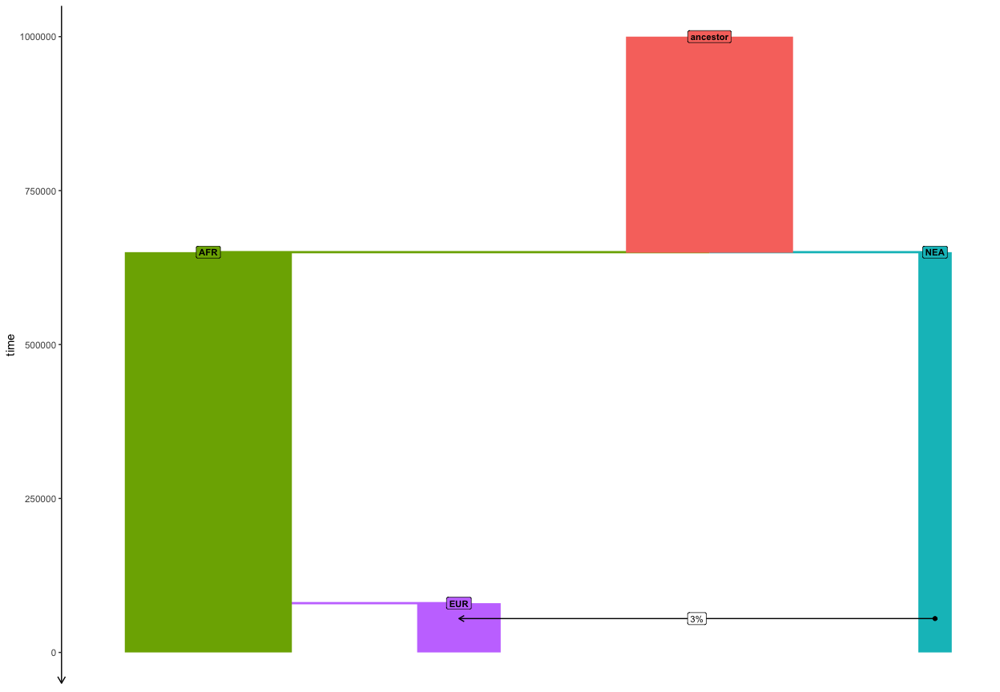
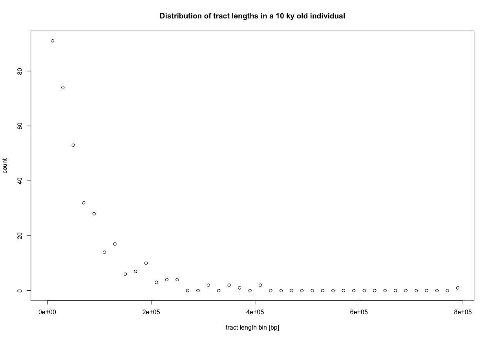
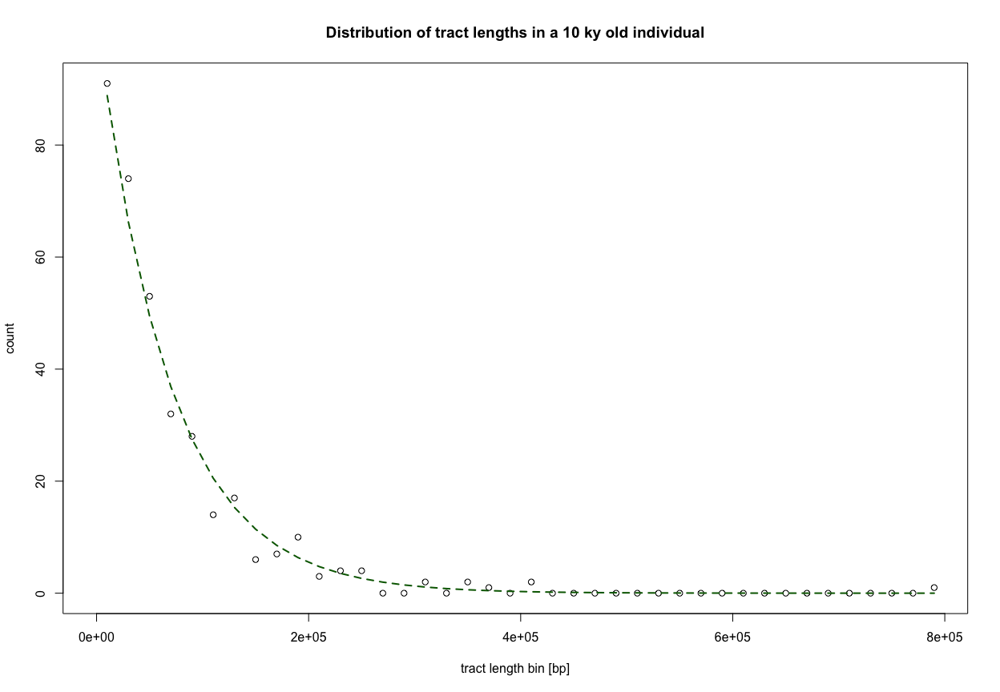
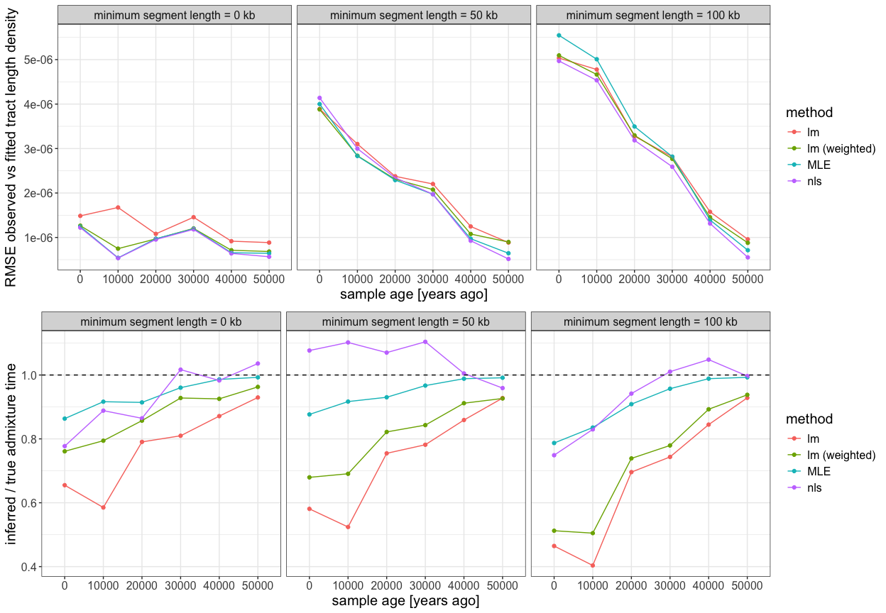
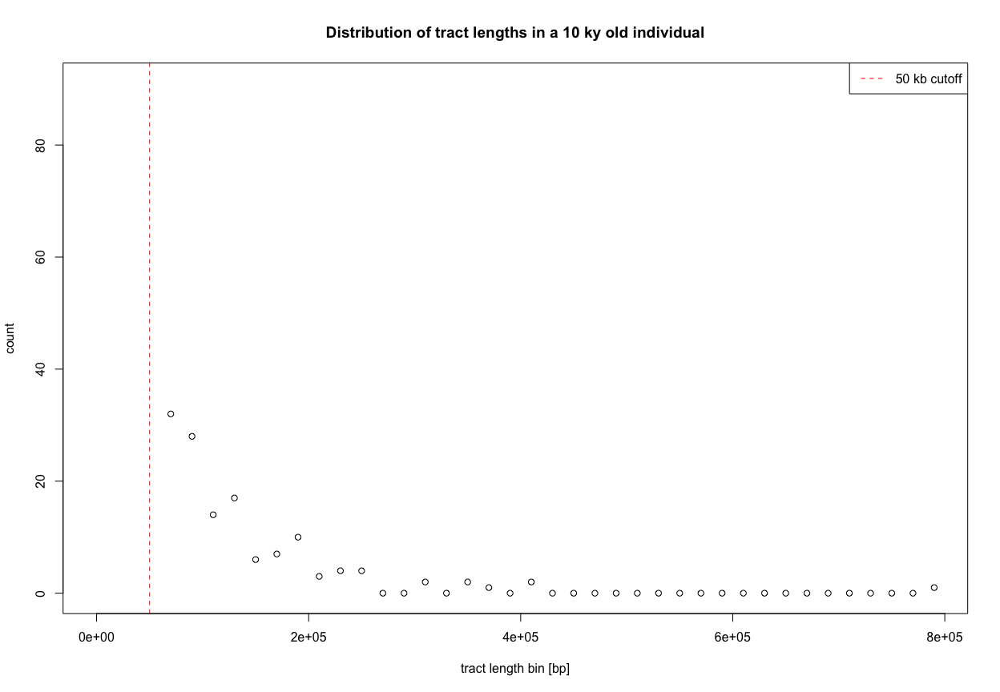
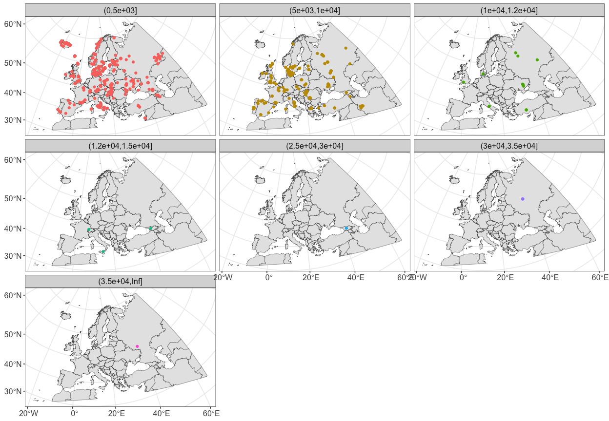
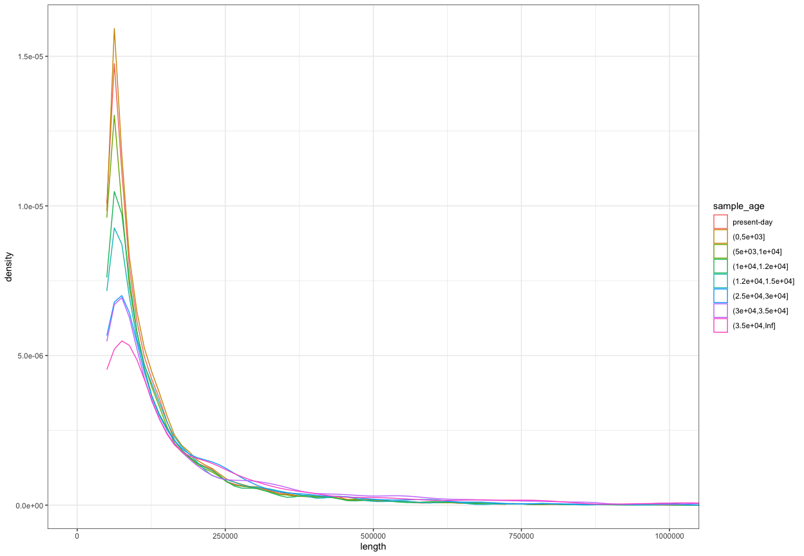
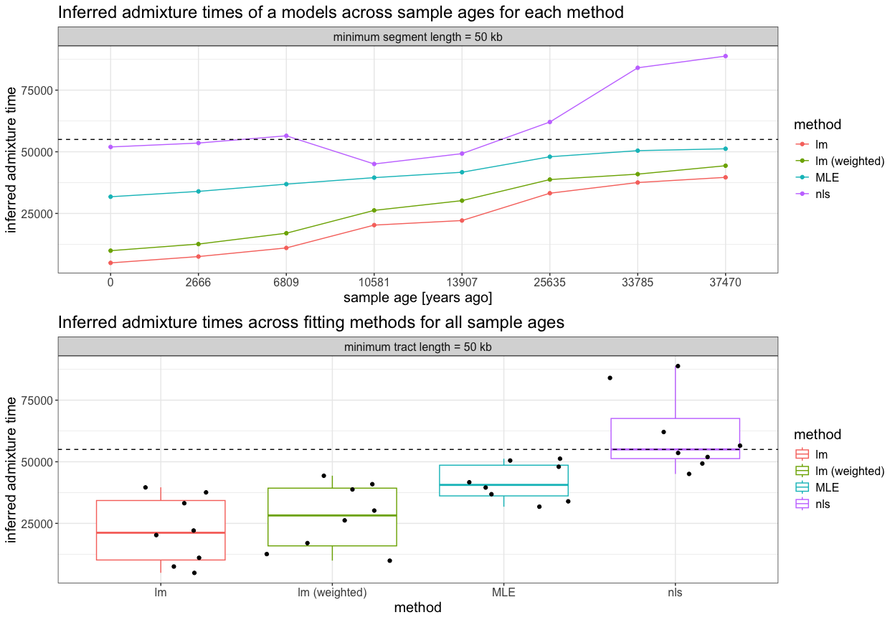
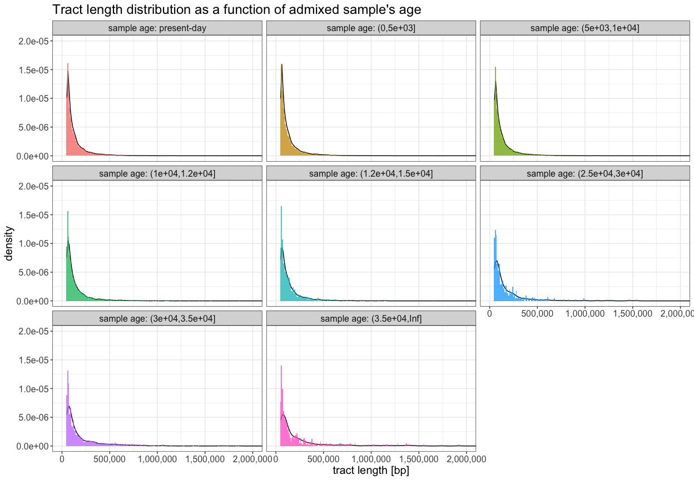
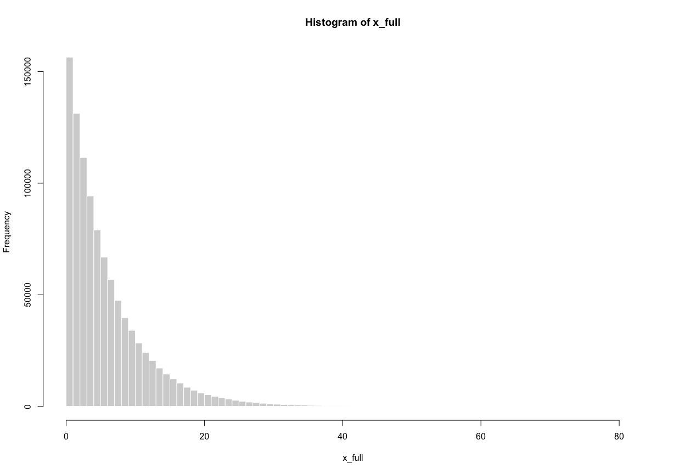

``` r
library(ggplot2)
library(readr)
library(dplyr)
#> 
#> Attaching package: 'dplyr'
#> The following objects are masked from 'package:stats':
#> 
#>     filter, lag
#> The following objects are masked from 'package:base':
#> 
#>     intersect, setdiff, setequal, union
library(tidyr)
library(Metrics)

library(slendr)
init_env(quiet = TRUE)

suppressPackageStartupMessages(source(here::here("utils.R")))
#> Warning: package 'GenomeInfoDb' was built under R version 4.3.3
```

## Testing the admixture dating methodology on simulations

``` r
anc <- population("ancestor", N = 10000, time = 1000000, remove = 649000)
afr <- population("AFR", parent = anc, N = 10000, time = 650000)
nea <- population("NEA", parent = anc, N = 2000, time = 650000)
eur <- population("EUR", parent = afr, N = 5000, time = 80000)

# https://www.science.org/doi/full/10.1126/sciadv.abm7047
gen_time <- 27
t_admix <- round(55000 / gen_time) * gen_time

gf <- gene_flow(from = nea, to = eur, rate = 0.03, start = t_admix, end = t_admix - gen_time)

model <- compile_model(
  populations = list(anc, afr, nea, eur), gene_flow = gf,
  generation_time = gen_time
)

samples <- schedule_sampling(model, times = c(50, 40, 30, 20, 10, 0) * 1e3, list(eur, 10))

plot_model(model, proportions = TRUE, order = c("AFR", "EUR", "ancestor", "NEA"))
```

<!-- -->

``` r
ts <- msprime(model, sequence_length = 100e6, recombination_rate = 1e-8, samples = samples, random_seed = 42)

tracts <- ts_tracts(ts, census = t_admix, quiet = TRUE)

head(tracts)
```

``` r
tracts_df <- tracts %>% dplyr::select(-node_id, -pop, -source_pop, -source_pop_id)

samples_df <- ts_samples(ts) %>% dplyr::rename(sample_age = time)

tracts_df <- inner_join(samples_df, tracts_df, by = "name")

write.table(tracts_df, file = "data/sim_tracts.tsv",
            sep = "\t", row.names = FALSE, col.names = TRUE, quote = FALSE)
```

``` r
tracts_df <- read_tsv("data/sim_tracts.tsv")
#> Rows: 4280 Columns: 6
#> ── Column specification ────────────────────────────────────────────────────────
#> Delimiter: "\t"
#> chr (2): name, pop
#> dbl (4): sample_age, left, right, length
#> 
#> ℹ Use `spec()` to retrieve the full column specification for this data.
#> ℹ Specify the column types or set `show_col_types = FALSE` to quiet this message.
```

## Tract-length distributions for different sample ages

**(I.e., different times since Neanderthal introgression.)**

### Complete admixture tracts

``` r
tracts_df %>%
ggplot() +
  geom_density(aes(length), alpha = 0.2) +
  geom_histogram(
    aes(x = length, y = after_stat(density), fill = as.factor(sample_age)),
    binwidth = 10000, alpha = 0.75
  ) +
  labs(
    x = "tract length [bp]", y = "density", fill = "age of sample",
    title = "Tract length distribution as a function of admixed sample's age"
  ) +
  scale_x_continuous(labels = scales::comma) +
  expand_limits(y = 0) +
  coord_cartesian(xlim = c(0, 1.5e6), ylim = c(0, 2e-5)) +
  theme_bw() +
  theme(legend.position = "none", text = element_text(size = 15)) +
  facet_wrap(~ sample_age, labeller = labeller(sample_age = function(x) paste("sample age =", x, "kya")))
```

<!-- -->

### Admixture tracts longer than 50 kb

``` r
filter(tracts_df, length > 50e3) %>%
ggplot() +
  geom_density(aes(length), alpha = 0.2) +
  geom_histogram(
    aes(x = length, y = after_stat(density), fill = as.factor(sample_age)),
    binwidth = 10000, alpha = 0.75
  ) +
  labs(
    x = "tract length [bp]", y = "density", fill = "age of sample",
    title = "Tract length distribution as a function of admixed sample's age"
  ) +
  geom_vline(xintercept = 50e3, linetype = 2) +
  scale_x_continuous(labels = scales::comma) +
  expand_limits(y = 0) +
  coord_cartesian(xlim = c(0, 1.5e6), ylim = c(0, 2e-5)) +
  theme_bw() +
  theme(legend.position = "none", text = element_text(size = 15)) +
  facet_wrap(~ sample_age, labeller = labeller(sample_age = function(x) paste("sample age =", x, "kya")))
```

<!-- -->

<!-- ```{r} -->
<!-- min_length <- 50e3 -->
<!-- ggplot() + -->
<!--   geom_density(data = tracts_df, -->
<!--                aes(length, y = after_stat(count), color = factor(sample_age), linetype = "unfiltered")) + -->
<!--   geom_density(data = filter(tracts_df, length >= min_length), -->
<!--                aes(length, y = after_stat(count), color = factor(sample_age), linetype = "filtered"), -->
<!--                color = "black") + -->
<!--   guides(color = "none") + -->
<!--   labs(linetype = "tracts") + -->
<!--   scale_linetype_manual(values = c("unfiltered" = "solid", "filtered" = "dashed")) + -->
<!--   facet_wrap(~ sample_age, labeller = labeller(sample_age = function(x) paste("sample age =", x, "kya"))) + -->
<!--   coord_cartesian(xlim = c(0, 1e6)) + -->
<!--   theme_bw() -->
<!-- ``` -->

## Estimating admixture time from tract lengths

``` r
# sample_age <- 0
# min_length <- 0

max_length <- Inf

results <- list()

pdf("dating_sims.pdf", width = 14, height = 8)

for (min_length in c(0, 50e3, 100e3)) {

  plot(1, type = "n", axes = FALSE, xlab = "", ylab = "", xlim = c(0, 1), ylim = c(0, 1))
  text(0.5, 0.5, paste("Minimum tract length:", as.integer(min_length), "bp"), cex = 3)
  
  for (sample_age in sort(unique(tracts_df$sample_age))) {
    
    # cat("minimum length:", min_length, "\nsample_age:", sample_age, "\n")
    
    r <- 1e-8
    
    filtered_tracts <- tracts_df %>% filter(sample_age == !!sample_age, length >= min_length, length <= max_length)
    
    bin_data <- hist(filtered_tracts$length, plot = FALSE, breaks = 100)
    density <- bin_data$density
    length <- bin_data$mids[density > 0]
    density <- density[density > 0]
    
    # lm estimate of admixture time
    #   -- based on log-transformed linear fit of density vs tract length
    lm_res <- lm(log(density) ~ length)
    lambda_lm <- -coef(lm_res)[["length"]]
    if (lambda_lm < 0) lambda_lm <- NA
    
    t_gens_lm <- lambda_lm / r
    t_lm <- t_gens_lm * gen_time + sample_age
    
    # weighted lm estimate of admixture time
    #   -- based on log-transformed linear fit of density vs tract length
    lmw_res <- lm(log(density) ~ length, weights = 1 / length)
    lambda_lmw <- -coef(lmw_res)[["length"]]
    if (lambda_lmw < 0) lambda_lmw <- NA
    
    t_gens_lmw <- lambda_lmw / r
    t_lmw <- t_gens_lmw * gen_time + sample_age
    
    # MLE estimate of admixture time
    #  -- based on computing average length as the expectation of the theoretical exponential distribution
    L <- mean(filtered_tracts$length)
    lambda_mean <- 1 / (L - min_length)
    
    t_gens_mean <- lambda_mean / r
    t_mean <- t_gens_mean * gen_time + sample_age
    
    # nls estimate -- computing the rate of decay (lambda) by fitting an exponential curve directly
    # https://www.rdocumentation.org/packages/stats/versions/3.6.2/topics/SSasymp 
    nls_res <- tryCatch(
      nls(density ~ SSasymp(length, Asym, R0, lrc)),
      error = function(e) NA, warning = function(w) NA
    )
    failed_nls <- !inherits(nls_res, "nls")
    lambda_nls <- if (failed_nls) NA else exp(unname(coef(nls_res)["lrc"]))
    t_gens_nls <- lambda_nls / r
    t_nls <- t_gens_nls * gen_time + sample_age
    
    # plotting
    orig_par <- par(no.readonly = TRUE)
    
    par(mfrow = c(1, 2))
    
    title <- sprintf("sample age %d, tract length [%d kb, %.1f Mb]",
                     sample_age, round(min_length / 1e3, 1), round(max_length / 1e6, 1))
    
    legends <- c(
      sprintf("lm fit: admixture %.1f generations prior ~ %.1f kya", t_gens_lm, round(t_lm / 1e3, 1)),
      sprintf("weighted lm fit: admixture %.1f generations prior ~ %.1f kya", t_gens_lmw, round(t_lmw / 1e3, 1)),
      sprintf("MLE fit: admixture %.1f generations prior ~ %.1f kya", t_gens_mean, round(t_mean / 1e3, 1)),
      sprintf("nls fit: admixture %.1f generations prior ~ %.1f kya", t_gens_nls, round(t_nls / 1e3, 1))
    )
    
    # plot the results on the original exponential scale (although we fit truncated exponential,
    # the rate corresponds to the shape of the original unfiltered exponential function, so we
    # compute dexp() on the original unfiltered x-axis scale for plotting purposes)
    x_values <- sort(unique(c(length, seq(0, max(tracts_df$length), by = 5000))))
    y_lm <- dexp(x_values, rate = lambda_lm)
    y_lmw <- dexp(x_values, rate = lambda_lmw)
    y_mean <- dexp(x_values, rate = lambda_mean)
    y_nls <- if (failed_nls) NA else predict(nls_res, newdata = data.frame(length = x_values + min_length))
    
    ylim <- c(min(c(density, y_lm, y_lmw, y_mean, y_nls), na.rm = TRUE),
              3e-5) #max(c(density, y_lm, y_mean, y_nls), na.rm = TRUE))
    plot(length, density, xlim = c(0, 1e6), main = title, ylim = ylim)
    abline(v = min_length, lty = "dashed")
    lines(x_values + min_length, y_lm, col = "purple", lty = 2, lwd = 2)
    lines(x_values + min_length, y_lmw, col = "darksalmon", lty = 2, lwd = 2)
    lines(x_values + min_length, y_mean, col = "blue", lty = 2, lwd = 2)
    if (!failed_nls)
      lines(x_values + min_length, y_nls, col = "green", lty = 2, lwd = 2)
    
    legend("topright", fill = c("purple", "darksalmon", "blue", "green"), legend = legends)
    
    # plot the results on the log-transformed scale
    plot(length, log(density), xlim = c(0, 1e6), main = title, ylim = c(-15, -11))
    abline(v = min_length, lty = "dashed")
    abline(lm_res, col = "purple", lty = 2, lwd = 2)
    abline(lmw_res, col = "darksalmon", lty = 2, lwd = 2)
    abline(a = log(lambda_mean) + lambda_mean * min_length, b = -lambda_mean, col = "blue", lty = 2, lwd = 2)
    if (!failed_nls)
      suppressWarnings(lines(x_values, log(y_nls), col = "green", lty = 2, lwd = 2))
    
    legend("topright", fill = c("purple", "darksalmon", "blue", "green"), legend = legends)
    
    par(orig_par)
    
    fitted_idx <- match(length, x_values)
    rmse_lm <- rmse(density, y_lm[fitted_idx])
    rmse_lmw <- rmse(density, y_lmw[fitted_idx])
    rmse_mean <- rmse(density, y_mean[fitted_idx])
    rmse_nls <- rmse(density, y_nls[fitted_idx])
    
    results[[length(results) + 1]] <- tibble(
      sample_age = sample_age,
      min_length = min_length,
      method = c("lm", "lm (weighted)", "MLE", "nls"),
      lambda = c(lambda_lm, lambda_lmw, lambda_mean, lambda_nls),
      rmse_density = c(rmse_lm, rmse_lmw, rmse_mean, rmse_nls),
      t_inferred = c(t_lm, t_lmw, t_mean, t_nls),
      ratio_time = t_inferred / t_admix
    )
  
  }
}

dev.off()
#> quartz_off_screen 
#>                 2

results_df <- do.call(rbind, results)
```

``` r
p_density <- results_df %>%
  ggplot(aes(as.factor(sample_age), rmse_density, color = method)) +
    geom_point() +
    geom_line(aes(group = method)) +
    theme_bw() +
    theme(text = element_text(size = 15)) +
    xlab("sample age [years ago]") +
    ylab("RMSE observed vs fitted tract length density") +
    facet_wrap(~ min_length,
               labeller = labeller(min_length = function(x) paste("minimum segment length =", as.integer(x) / 1e3, "kb")))

p_time <- results_df %>%
  ggplot(aes(as.factor(sample_age), ratio_time, color = method)) +
    geom_point() +
    geom_line(aes(group = method)) +
    geom_hline(yintercept = 1, linetype = "dashed") +
    theme_bw() +
    theme(text = element_text(size = 15)) +
    xlab("sample age [years ago]") +
    ylab("inferred / true admixture time") +
    facet_wrap(~ min_length,
               labeller = labeller(min_length = function(x) paste("minimum segment length =", as.integer(x) / 1e3, "kb")))

cowplot::plot_grid(p_density, p_time, nrow = 2)
```

<!-- -->

**Note:** The stricted the minimum length cutoff, the higher the RMSE of
a fit against the real data, and this is worse the younger the sample
is. This is because young samples have the highest proportion of very
short tracts (and very few longer tracts), so the exponential decay data
is actually the noisiest, and the fit is necessarily poorer. It’s the
opposite for the oldest samples, which have much fewer short tracts (so
the distribution is less affected by filtering for minimum length) and
many more longer tracts (which are not affected by filtering at all).

``` r
p_density2 <- results_df %>%
  ggplot(aes(method, rmse_density)) +
  geom_boxplot(aes(color = method)) +
  geom_jitter() +
  expand_limits(y = 0) +
  theme_bw() +
  theme(text = element_text(size = 15)) +
  facet_wrap(
    ~ min_length,
    labeller = labeller(min_length = function(x) paste("minimum tract length =", as.integer(x) / 1e3, "kb"))
  )

p_time2 <- results_df %>%
  ggplot(aes(method, ratio_time)) +
  geom_boxplot(aes(color = method)) +
  geom_jitter() +
  geom_hline(yintercept = 1, linetype = "dashed") +
  theme_bw() +
  theme(text = element_text(size = 15)) +
  facet_wrap(
    ~ min_length,
    labeller = labeller(min_length = function(x) paste("minimum tract length =", as.integer(x) / 1e3, "kb"))
  )

cowplot::plot_grid(p_density2, p_time2, nrow = 2)
```

<!-- -->

## Estimating admixture time from tract lengths v2

``` r
# min_length <- 0

pdf("dating_sims_v2.pdf", width = 12, height = 10)

results_v2 <- list()

max_length <- Inf

for (min_length in c(0, 50e3, 100e3, 150e3, 200e3, 250e3, 300e3)) {
  tracts_filt_df <- tracts_df %>% filter(length >= min_length, length <= max_length)

  p_tracts <-
    ggplot() +
    geom_histogram(
      data = tracts_filt_df, aes(x = length, y = after_stat(density), fill = as.factor(sample_age)),
      binwidth = 10000, alpha = 0.75) +
    # geom_density(
    #   data = tracts_filt_df, aes(x = length, y = after_stat(density), fill = as.factor(sample_age)),
    #   bw = 5000, alpha = 0.75, color = FALSE) +
    labs(
      x = "tract length [bp]", y = "density", fill = "age of sample",
      title = "Tract length distribution as a function of admixed sample's age",
      subtitle = paste0(
        "(assuming single-pulse admixture at ~ 55 kya, tract length [",
        as.integer(min_length / 1e3), " kb, ", max_length / 1e6," Mb])"
      )
    ) +
    scale_x_continuous(labels = scales::comma) +
    expand_limits(y = 0, x = 0) +
    coord_cartesian(ylim = c(0, 2e-5)) +
    theme_minimal() +
    theme(legend.position = "none", text = element_text(size = 15)) +
    facet_wrap(~ sample_age, labeller = labeller(sample_age = function(x) paste("sample age =", x, "kya")))
  
  r <- 1e-8
  
  exp_df <- group_by(tracts_filt_df, sample_age) %>%
    summarise(L = mean(length)) %>%
    mutate(
      lambda = 1 / (L - min_length),
      t_gen = lambda / r,
      t_before = t_gen * gen_time,
      t_inferred = t_before + sample_age
    )
  
  exp_decay <- function(lambda, max) {
    data.frame(length = seq(0, max, by = 1000)) %>%
      mutate(density = dexp(length, rate = lambda))
  }
  
  predictions_df <-
    exp_df %>%
    select(sample_age, lambda) %>%
    rowwise() %>%
    mutate(exp_data = list(exp_decay(lambda, max(tracts_filt_df$length)))) %>%
    unnest(cols = c(exp_data)) %>%
    select(-lambda)
  
  p_fit <- p_tracts +
    geom_line(data = predictions_df, aes(x = length + min_length, y = density),
              linetype = "dashed", linewidth = 0.75, color = "black") +
    geom_text(data = exp_df,
              aes(x = Inf, y = Inf, color = as.factor(sample_age),
                  label = paste0(
                    "estimated admixture at ", round(t_inferred / 1e3, 1), " kya\n",
                    "(", round(t_gen), " generations prior)"
                  )),
              hjust = 1.2, vjust = 8, size = 4)
  
  print(p_fit)
  
  results_v2[[length(results_v2) + 1]] <- exp_df %>% mutate(min_length = min_length)
}

dev.off()
#> quartz_off_screen 
#>                 2

results_v2_df <- do.call(rbind, results_v2)
```

``` r
inner_join(
  filter(results_df, method == "MLE") %>% select(sample_age, min_length, t_inferred),
  select(results_v2_df, sample_age, min_length, t_inferred),
  by = c("sample_age", "min_length")
) %>%
  mutate(equal = t_inferred.x == t_inferred.y) %>%
  .$equal %>%
  all()
#> [1] TRUE
```

## Admixture dating in empirical data

``` r
metadata <- read_metadata()
#> Rows: 4172 Columns: 32
#> ── Column specification ────────────────────────────────────────────────────────
#> Delimiter: "\t"
#> chr (22): sampleId, popId, site, country, region, groupLabel, groupAge, flag...
#> dbl (10): shapeA, latitude, longitude, age14C, ageHigh, ageLow, ageAverage, ...
#> 
#> ℹ Use `spec()` to retrieve the full column specification for this data.
#> ℹ Specify the column types or set `show_col_types = FALSE` to quiet this message.

metadata$sample_age <- cut(metadata$ageAverage,
                           breaks = c(Inf, 35e3, 30e3, 25e3, 20e3, 15e3, 12e3, 10e3, 5e3,  0))

group_levels <- levels(metadata$sample_age)

metadata <- metadata %>%
  mutate(
    sample_age = as.character(sample_age),
    sample_age = ifelse(is.na(sample_age), "present-day", sample_age),
    sample_age = factor(sample_age, levels = c("present-day", group_levels))
  )

ggplot(metadata) +
  geom_jitter(aes(sample_age, ageAverage, color = sample_age)) +
  theme_bw() +
  theme(legend.position = "none", text = element_text(size = 15, angle = 45, hjust = 1),
        axis.title.x = element_text(size = 15, angle = 0, hjust = 0.5))
```

<!-- -->

``` r
metadata %>%
  group_by(sample_age) %>%
  summarise(mean(ageAverage))
#> # A tibble: 8 × 2
#>   sample_age        `mean(ageAverage)`
#>   <fct>                          <dbl>
#> 1 present-day                       0 
#> 2 (0,5e+03]                      1970.
#> 3 (5e+03,1e+04]                  6738.
#> 4 (1e+04,1.2e+04]               10652.
#> 5 (1.2e+04,1.5e+04]             13907.
#> 6 (2.5e+04,3e+04]               25635 
#> 7 (3e+04,3.5e+04]               33785.
#> 8 (3.5e+04,Inf]                 37470
```

``` r
library(sf)
#> Linking to GEOS 3.11.0, GDAL 3.5.3, PROJ 9.1.0; sf_use_s2() is TRUE
library(rnaturalearth)

world <- ne_countries(scale = "medium", returnclass = "sf")
sf::st_agr(world) <- "constant"
bbox <- st_as_sfc(st_bbox(c(xmin = -25, xmax = 65, ymin = 25, ymax = 70), crs = st_crs(world)))
western_eurasia <- st_crop(st_make_valid(world), bbox)

metadata %>%
  filter(!is.na(latitude) & !is.na(longitude)) %>%
  st_as_sf(coords = c("longitude", "latitude")) %>%
  st_set_crs(4326) %>%
  ggplot() +
    geom_sf(data = western_eurasia) +
    geom_sf(aes(color = sample_age)) +
    coord_sf(crs = 3035) +
    facet_wrap(~ sample_age) +
    theme_bw() +
    theme(legend.position = "none", text = element_text(size = 15))
```

<!-- -->

``` r
tracts_df <- rbind(read_tracts("Modern", metadata), read_tracts("Ancient", metadata))
#> Rows: 1272453 Columns: 26
#> ── Column specification ────────────────────────────────────────────────────────
#> Delimiter: "\t"
#> chr  (8): ID, population, superpop, region, clusterAlias, pop, groupAge, arc...
#> dbl (17): ageAverage, chrom, start, end, slod, sites, positive_lods, negativ...
#> lgl  (1): anc
#> 
#> ℹ Use `spec()` to retrieve the full column specification for this data.
#> ℹ Specify the column types or set `show_col_types = FALSE` to quiet this message.
#> Rows: 1272453 Columns: 26
#> ── Column specification ────────────────────────────────────────────────────────
#> Delimiter: "\t"
#> chr  (8): ID, population, superpop, region, clusterAlias, pop, groupAge, arc...
#> dbl (17): ageAverage, chrom, start, end, slod, sites, positive_lods, negativ...
#> lgl  (1): anc
#> 
#> ℹ Use `spec()` to retrieve the full column specification for this data.
#> ℹ Specify the column types or set `show_col_types = FALSE` to quiet this message.

tracts_df <- select(metadata, sampleId, ageAverage, sample_age, coverage) %>%
  inner_join(tracts_df, by = c("sampleId" = "ID"))
```

``` r
ggplot() +
  geom_density(data = tracts_df, aes(length), alpha = 0.2) +
  geom_histogram(
    data = tracts_df, aes(x = length, y = after_stat(density), fill = as.factor(sample_age)),
    binwidth = 10000, alpha = 0.75
  ) +
  labs(
    x = "tract length [bp]", y = "density", fill = "age of sample",
    title = "Tract length distribution as a function of admixed sample's age"
  ) +
  scale_x_continuous(labels = scales::comma) +
  expand_limits(y = 0) +
  coord_cartesian(ylim = c(0, 2e-5), xlim = c(0, 1e6)) +
  theme_bw() +
  theme(legend.position = "none", text = element_text(size = 15)) +
  facet_wrap(~ sample_age, labeller = labeller(sample_age = function(x) paste("sample age:", x)))
```

<!-- -->

``` r
ggplot(tracts_df) +
  geom_density(aes(length, color = sample_age)) +
  coord_cartesian(xlim = c(0, 1e6)) +
  theme_bw()
```

<!-- -->

``` r
# sample_age <- "present-day"
# min_length <- 50e3

max_length <- 1e6

results <- list()

pdf("dating_empirical.pdf", width = 14, height = 8)

for (min_length in c(50e3)) {

  plot(1, type = "n", axes = FALSE, xlab = "", ylab = "", xlim = c(0, 1), ylim = c(0, 1))
  text(0.5, 0.5, paste("Minimum tract length:", as.integer(min_length), "bp"), cex = 3)
  
  for (sample_age in sort(unique(tracts_df$sample_age))) {
    
    # cat("minimum length:", min_length, "\nsample_age:", sample_age, "\n")
    
    r <- 1e-8
    
    filtered_tracts <- tracts_df %>% filter(sample_age == !!sample_age, length >= min_length, length <= max_length)
    # replace the sample age factor level with the actual numerical age
    sample_age <- unique(filtered_tracts$ageAverage) %>% mean() %>% round(0)
    
    bin_data <- hist(filtered_tracts$length, plot = FALSE, breaks = 100)
    density <- bin_data$density
    length <- bin_data$mids[density > 0]
    density <- density[density > 0]
    
    # lm estimate of admixture time
    #   -- based on log-transformed linear fit of density vs tract length
    lm_res <- lm(log(density) ~ length)
    lambda_lm <- -coef(lm_res)[["length"]]
    if (lambda_lm < 0) lambda_lm <- NA
    
    t_gens_lm <- lambda_lm / r
    t_lm <- t_gens_lm * gen_time + sample_age
    
    # weighted lm estimate of admixture time
    #   -- based on log-transformed linear fit of density vs tract length
    lmw_res <- lm(log(density) ~ length, weights = 1 / length)
    lambda_lmw <- -coef(lmw_res)[["length"]]
    if (lambda_lmw < 0) lambda_lmw <- NA
    
    t_gens_lmw <- lambda_lmw / r
    t_lmw <- t_gens_lmw * gen_time + sample_age
    
    # MLE estimate of admixture time
    #  -- based on computing average length as the expectation of the theoretical exponential distribution
    L <- mean(filtered_tracts$length)
    lambda_mean <- 1 / (L - min_length)
    
    t_gens_mean <- lambda_mean / r
    t_mean <- t_gens_mean * gen_time + sample_age
    
    # nls estimate -- computing the rate of decay (lambda) by fitting an exponential curve directly
    # https://www.rdocumentation.org/packages/stats/versions/3.6.2/topics/SSasymp 
    nls_res <- tryCatch(
      nls(density ~ SSasymp(length, Asym, R0, lrc)),
      error = function(e) NA, warning = function(w) NA
    )
    failed_nls <- !inherits(nls_res, "nls")
    lambda_nls <- if (failed_nls) NA else exp(unname(coef(nls_res)["lrc"]))
    t_gens_nls <- lambda_nls / r
    t_nls <- t_gens_nls * gen_time + sample_age
    
    # plotting
    orig_par <- par(no.readonly = TRUE)
    
    par(mfrow = c(1, 2))
    
    title <- sprintf("sample age %.1f, tract length [%d kb, %.1f Mb]",
                     sample_age, round(min_length / 1e3, 1), round(max_length / 1e6, 1))
    
    legends <- c(
      sprintf("lm fit: admixture %.1f generations prior ~ %.1f kya", t_gens_lm, round(t_lm / 1e3, 1)),
      sprintf("weighted lm fit: admixture %.1f generations prior ~ %.1f kya", t_gens_lmw, round(t_lmw / 1e3, 1)),
      sprintf("MLE fit: admixture %.1f generations prior ~ %.1f kya", t_gens_mean, round(t_mean / 1e3, 1)),
      sprintf("nls fit: admixture %.1f generations prior ~ %.1f kya", t_gens_nls, round(t_nls / 1e3, 1))
    )
    
    # plot the results on the original exponential scale (although we fit truncated exponential,
    # the rate corresponds to the shape of the original unfiltered exponential function, so we
    # compute dexp() on the original unfiltered x-axis scale for plotting purposes)
    x_values <- sort(unique(c(length, seq(0, max(tracts_df$length), by = 5000))))
    y_lm <- dexp(x_values, rate = lambda_lm)
    y_lmw <- dexp(x_values, rate = lambda_lmw)
    y_mean <- dexp(x_values, rate = lambda_mean)
    y_nls <- if (failed_nls) NA else predict(nls_res, newdata = data.frame(length = x_values + min_length))
    
    ylim <- c(min(c(density, y_lm, y_lmw, y_mean, y_nls), na.rm = TRUE),
              3e-5) #max(c(density, y_lm, y_mean, y_nls), na.rm = TRUE))
    plot(length, density, xlim = c(0, 1e6), main = title, ylim = ylim)
    abline(v = min_length, lty = "dashed")
    lines(x_values + min_length, y_lm, col = "purple", lty = 2, lwd = 2)
    lines(x_values + min_length, y_lmw, col = "darksalmon", lty = 2, lwd = 2)
    lines(x_values + min_length, y_mean, col = "blue", lty = 2, lwd = 2)
    if (!failed_nls)
      lines(x_values + min_length, y_nls, col = "green", lty = 2, lwd = 2)
    
    legend("topright", fill = c("purple", "darksalmon", "blue", "green"), legend = legends)
    
    # plot the results on the log-transformed scale
    plot(length, log(density), xlim = c(0, 1e6), main = title, ylim = c(-15, -11))
    abline(v = min_length, lty = "dashed")
    abline(lm_res, col = "purple", lty = 2, lwd = 2)
    abline(lmw_res, col = "darksalmon", lty = 2, lwd = 2)
    abline(a = log(lambda_mean) + lambda_mean * min_length, b = -lambda_mean, col = "blue", lty = 2, lwd = 2)
    if (!failed_nls)
      suppressWarnings(lines(x_values, log(y_nls), col = "green", lty = 2, lwd = 2))
    
    legend("topright", fill = c("purple", "darksalmon", "blue", "green"), legend = legends)
    
    par(orig_par)
    
    fitted_idx <- match(length, x_values)
    rmse_lm <- rmse(density, y_lm[fitted_idx])
    rmse_lmw <- rmse(density, y_lmw[fitted_idx])
    rmse_mean <- rmse(density, y_mean[fitted_idx])
    rmse_nls <- rmse(density, y_nls[fitted_idx])
    
    results[[length(results) + 1]] <- tibble(
      sample_age = sample_age,
      min_length = min_length,
      method = c("lm", "lm (weighted)", "MLE", "nls"),
      lambda = c(lambda_lm, lambda_lmw, lambda_mean, lambda_nls),
      rmse_density = c(rmse_lm, rmse_lmw, rmse_mean, rmse_nls),
      t_inferred = c(t_lm, t_lmw, t_mean, t_nls)
    )
  
  }
}

dev.off()
#> quartz_off_screen 
#>                 2

results_df <- do.call(rbind, results)
```

``` r
p_density <- results_df %>%
  ggplot(aes(as.factor(sample_age), rmse_density, color = method)) +
    geom_point() +
    geom_line(aes(group = method)) +
    theme_bw() +
    theme(text = element_text(size = 15)) +
    xlab("sample age [years ago]") +
    ylab("RMSE observed vs fitted tract length density") +
    facet_wrap(~ min_length,
               labeller = labeller(min_length = function(x) paste("minimum segment length =", as.integer(x) / 1e3, "kb"))) +
    ggtitle("RMSE of a models across sample ages for each method")
  
p_density2 <- results_df %>%
  ggplot(aes(method, rmse_density)) +
  geom_boxplot(aes(color = method)) +
  geom_jitter() +
  theme_bw() +
  theme(text = element_text(size = 15)) +
  facet_wrap(
    ~ min_length,
    labeller = labeller(min_length = function(x) paste("minimum tract length =", as.integer(x) / 1e3, "kb"))
  ) +
  ggtitle("RMSE of a models across fitting methods for all sample ages")

cowplot::plot_grid(p_density, p_density2, nrow = 2)
```

<!-- -->

``` r
p_time <- results_df %>%
  ggplot(aes(as.factor(sample_age), t_inferred, color = method)) +
  geom_point() +
  geom_line(aes(group = method)) +
  geom_hline(yintercept = 55e3, linetype = "dashed") +
  theme_bw() +
  theme(text = element_text(size = 15)) +
  xlab("sample age [years ago]") +
  ylab("inferred admixture time") +
  facet_wrap(~ min_length,
             labeller = labeller(min_length = function(x) paste("minimum segment length =", as.integer(x) / 1e3, "kb"))) +
  ggtitle("Inferred admixture times of a models across sample ages for each method")
  
p_time2 <- results_df %>%
  ggplot(aes(method, t_inferred)) +
  geom_boxplot(aes(color = method)) +
  geom_jitter() +
  geom_hline(yintercept = 55e3, linetype = "dashed") +
  ylab("inferred admixture time") +
  theme_bw() +
  theme(text = element_text(size = 15)) +
  facet_wrap(
    ~ min_length,
    labeller = labeller(min_length = function(x) paste("minimum tract length =", as.integer(x) / 1e3, "kb"))
  ) +
  ggtitle("Inferred admixture times across fitting methods for all sample ages")

cowplot::plot_grid(p_time, p_time2, nrow = 2)
```

<!-- -->

## Fitting exponential decay of truncated distributions

Exploring the basic modeling techniques used above.

**This is a “complete” exponential distribution.** It has a rate
parameter $\lambda$ and will have the expected value of $1 / \lambda$.

``` r
set.seed(42)

lambda_true <- 0.1
(mean_true <- 1 / lambda_true)
#> [1] 10

x_full <- rexp(1e6, rate = lambda_true)

h_full <- hist(x_full, breaks = 100, freq = TRUE, border = FALSE)
```

<!-- -->

We can fit an exponential function using a MLE estimate of $\lambda$,
which can be computed from an estimate of the mean $\bar{x}$ of the
observed data as $\hat{\lambda} = 1 / \bar{x}$:

``` r
(mean_full <- mean(x_full))
#> [1] 10.00159
(lambda_full <- 1 / mean_full)
#> [1] 0.09998413
```

We can then plot the fitted exponential over the “observed data” using
this estimated $\hat{\lambda}$:

``` r
h_full <- hist(x_full, breaks = 100, freq = TRUE, border = FALSE)

x_values <- h_full$mids
y_values <- dexp(x_values, rate = lambda_full)
lines(x_values, sum(h_full$counts) * y_values, col = "orange", lty = "dashed", lwd = 3)
```

<!-- -->

Let’s now truncate the observed exponentially-distributed data starting
from a given cutoff value $c$.

``` r
c <- 5
x_trunc <- x_full[x_full > c]

# h_full <- hist(x_full, breaks = 100, freq = TRUE, border = FALSE)
h_trunc <- hist(x_trunc, breaks = 100, ylim = c(0, max(h_full$counts)), col = "grey36", border = FALSE)
```

<!-- -->

The mean of the truncated exponential $\bar{x}'$ is:

``` r
mean(x_trunc)
#> [1] 14.99515
```

And the MLE of the rate parameter $\lambda'$ can be again computed as
$\hat{\lambda}' = 1 / \bar{x}'$:

``` r
1 / mean(x_trunc)
#> [1] 0.06668824
```

It turns out that the expected value of the original (non-truncated)
distribution $\bar{x}$ can be estimated from the mean of the truncated
data $\bar{x}'$ as $\bar{x}' - c$:

``` r
mean(x_trunc) - c
#> [1] 9.995147
```

And, as shown above, because the MLE of the rate $\lambda$ of an
exponential distribution can be estimated from its mean $\bar{x}$, we
can estimate the $\lambda$ of the original (non-truncated) distribution
from the mean $\bar{x}'$ of distribution truncated from $c$ as
$\hat{\lambda} = 1 / (\bar{x}' - c)$:

``` r
(lambda_hat <- 1 / (mean(x_trunc) - c))
#> [1] 0.1000486
```

Let’s verify this by overlaying the exponential curve with the rate
$\hat{\lambda}$ (i.e. estimated rate of the non-truncated distribution)
over the truncated data:

``` r
h_full <- hist(x_full, breaks = 100, freq = TRUE, border = FALSE)
h_trunc <- hist(x_trunc, breaks = 100, ylim = c(0, max(h_full$counts)), add = TRUE, col = "grey36", border = FALSE)
```

<!-- -->

``` r
h_full <- hist(x_full, breaks = 100, freq = TRUE, border = FALSE)
h_trunc <- hist(x_trunc, breaks = 100, ylim = c(0, max(h_full$counts)), add = TRUE, col = "grey36", border = FALSE)

x_values <- h_trunc$mids
y_values <- dexp(x_values, rate = lambda_hat)
lines(x_values, sum(h_full$counts) * y_values, col = "red", lty = "dashed", lwd = 3)
```

<!-- -->

``` r
h_full <- hist(x_full, breaks = 100, freq = TRUE, border = FALSE)
h_trunc <- hist(x_trunc, breaks = 100, ylim = c(0, max(h_full$counts)), add = TRUE, col = "grey36", border = FALSE)

x_values <- h_trunc$mids
y_values <- dexp(x_values, rate = lambda_hat)
lines(x_values, sum(h_full$counts) * y_values, col = "red", lty = "dashed", lwd = 3)

x_values <- h_full$mids
y_values <- dexp(x_values, rate = lambda_full)
lines(x_values, sum(h_full$counts) * y_values, col = "orange", lty = "dashed", lwd = 3)
```

<!-- -->

Basically, what we’re doing by this is take the truncated distribution
(truncated from $c$ to the right) as if it was some other non-truncated
distribution. The fitted line works because we then shift `x_values` to
the right by `c`.

## Sanity checks of my filtering against Alba’s Figure 2. B/C

``` r
tracts_df <- rbind(read_tracts("Modern", metadata), read_tracts("Ancient", metadata))
#> Rows: 1272453 Columns: 26
#> ── Column specification ────────────────────────────────────────────────────────
#> Delimiter: "\t"
#> chr  (8): ID, population, superpop, region, clusterAlias, pop, groupAge, arc...
#> dbl (17): ageAverage, chrom, start, end, slod, sites, positive_lods, negativ...
#> lgl  (1): anc
#> 
#> ℹ Use `spec()` to retrieve the full column specification for this data.
#> ℹ Specify the column types or set `show_col_types = FALSE` to quiet this message.
#> Rows: 1272453 Columns: 26
#> ── Column specification ────────────────────────────────────────────────────────
#> Delimiter: "\t"
#> chr  (8): ID, population, superpop, region, clusterAlias, pop, groupAge, arc...
#> dbl (17): ageAverage, chrom, start, end, slod, sites, positive_lods, negativ...
#> lgl  (1): anc
#> 
#> ℹ Use `spec()` to retrieve the full column specification for this data.
#> ℹ Specify the column types or set `show_col_types = FALSE` to quiet this message.

tracts_df <- select(metadata, sampleId, ageAverage, coverage) %>%
  inner_join(tracts_df, by = c("sampleId" = "ID"))

tracts_df$age_group <- cut(
  tracts_df$ageAverage,
  breaks = c(Inf, 20e3, 10e3, 5e3, 100, 0),
)

group_levels <- levels(tracts_df$age_group)

tracts_df <- tracts_df %>%
  mutate(
    age_group = as.character(age_group),
    age_group = ifelse(is.na(age_group), "present-day", age_group),
    age_group = factor(age_group, levels = c("present-day", group_levels))
  )
```

``` r
tapply(tracts_df$length, tracts_df$age_group, summary)
#> $`present-day`
#>    Min. 1st Qu.  Median    Mean 3rd Qu.    Max. 
#>   50000   63945   90686  134987  149351 6089550 
#> 
#> $`(0,100]`
#> NULL
#> 
#> $`(100,5e+03]`
#>    Min. 1st Qu.  Median    Mean 3rd Qu.    Max. 
#>   50000   64263   91397  136335  151508 6080785 
#> 
#> $`(5e+03,1e+04]`
#>    Min. 1st Qu.  Median    Mean 3rd Qu.    Max. 
#>   50000   64798   92585  139766  154420 6527040 
#> 
#> $`(1e+04,2e+04]`
#>    Min. 1st Qu.  Median    Mean 3rd Qu.    Max. 
#>   50007   64897   93809  144052  159122 2228427 
#> 
#> $`(2e+04,Inf]`
#>    Min. 1st Qu.  Median    Mean 3rd Qu.    Max. 
#>   50010   67104  107215  210207  222540 5347136
```

``` r
ggplot(tracts_df) +
  geom_density(aes(length, color = age_group)) +
  scale_x_log10()
```

<!-- -->

``` r
ggplot(tracts_df) +
  geom_density(aes(length, color = age_group)) +
  coord_cartesian(xlim = c(0, 1e6))
```

<!-- -->

``` r
ggplot(tracts_df) +
  geom_boxplot(aes(age_group, length, color = age_group)) +
  geom_hline(yintercept = c(50e3, 250e3), linetype = "dashed")
```

<!-- -->

``` r
ggplot(tracts_df) +
  geom_boxplot(aes(age_group, length, color = age_group)) +
  geom_hline(yintercept = c(50e3, 250e3), linetype = "dashed") +
  coord_cartesian(ylim = c(50e3, 250e3)) 
```

<!-- -->
