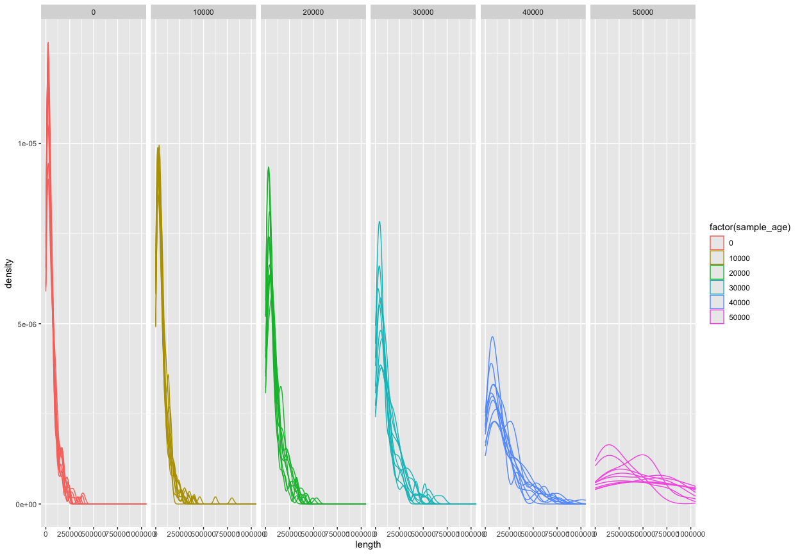
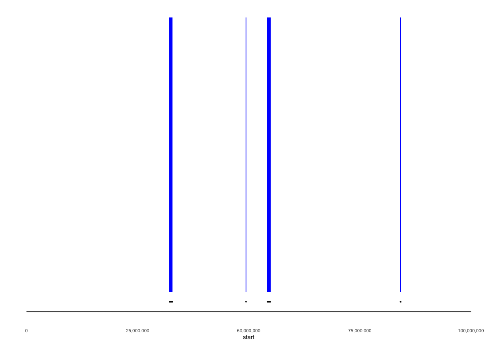
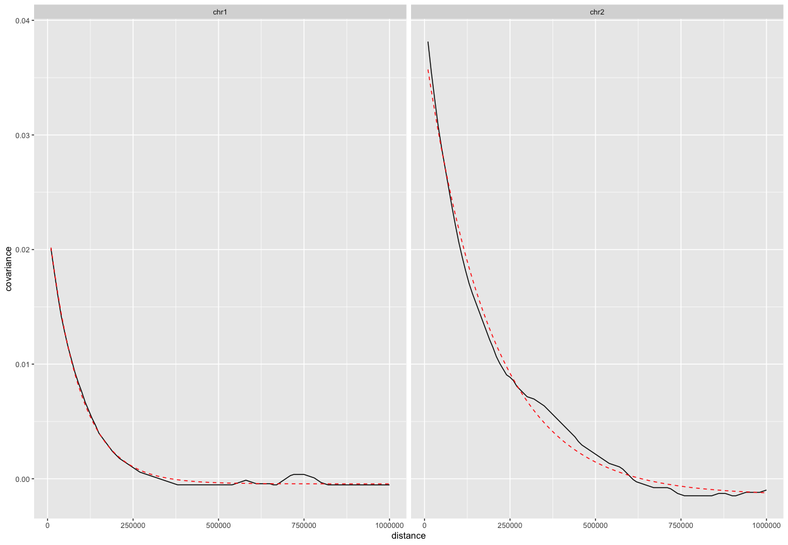
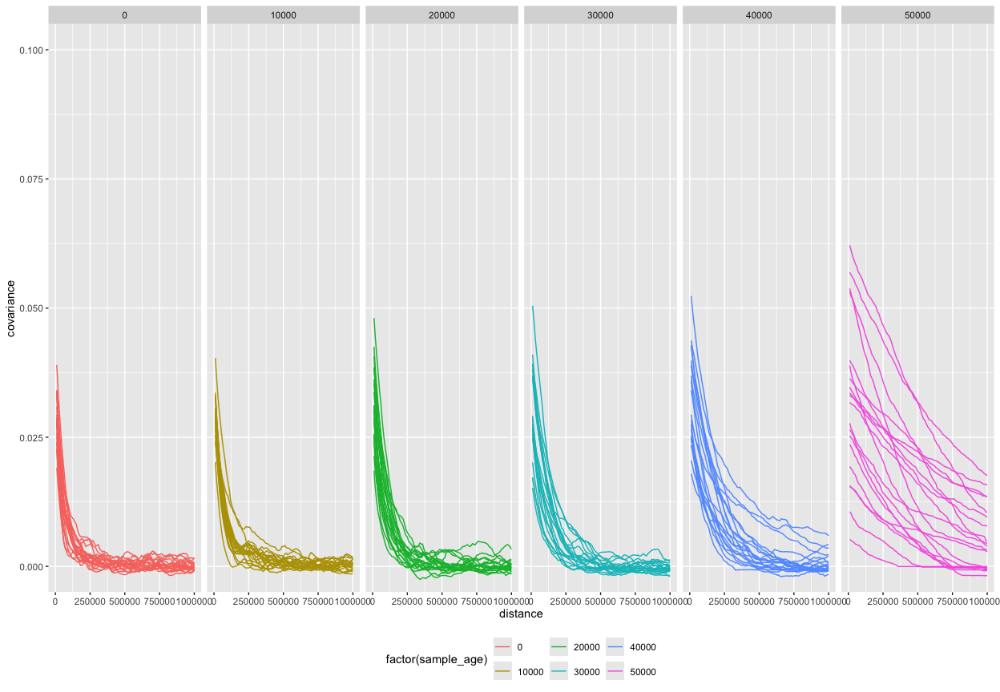
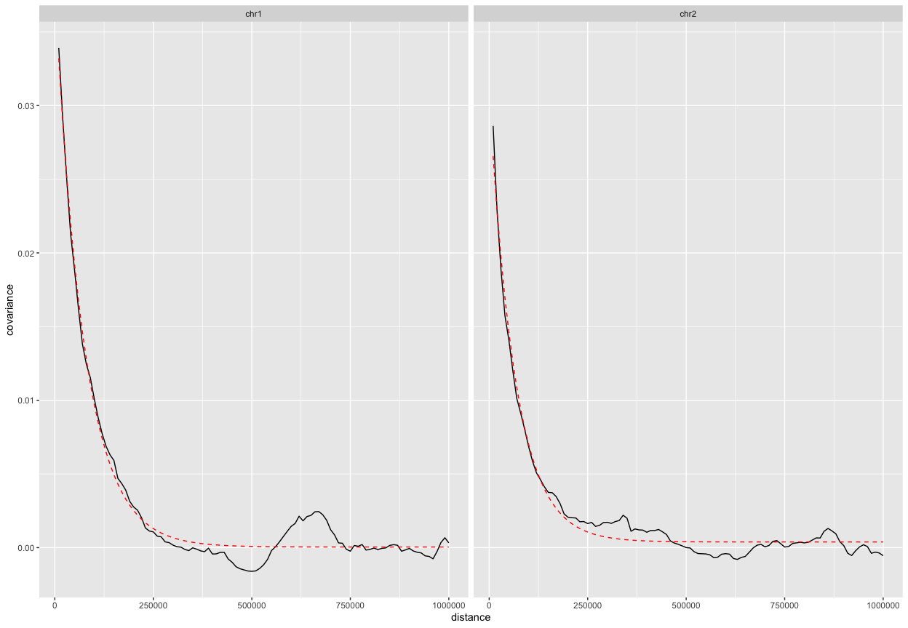
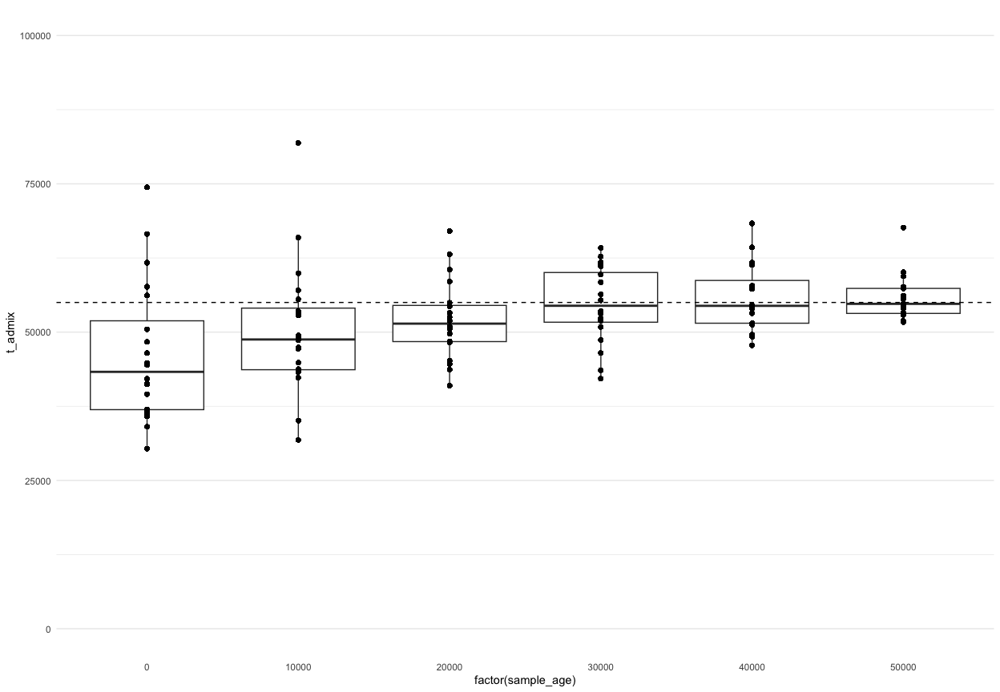
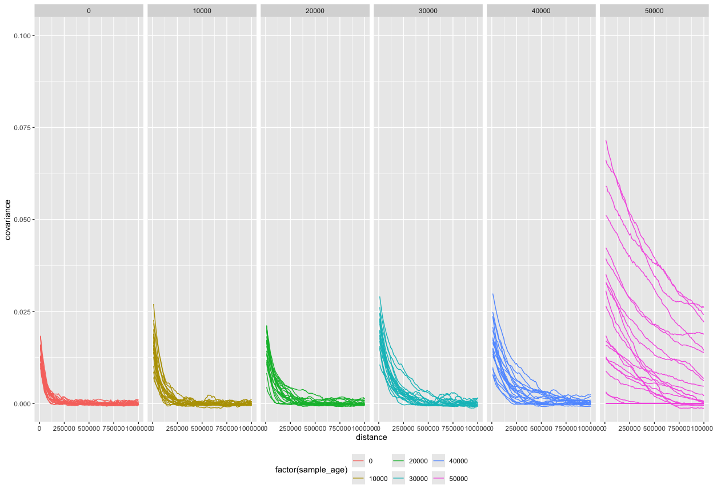
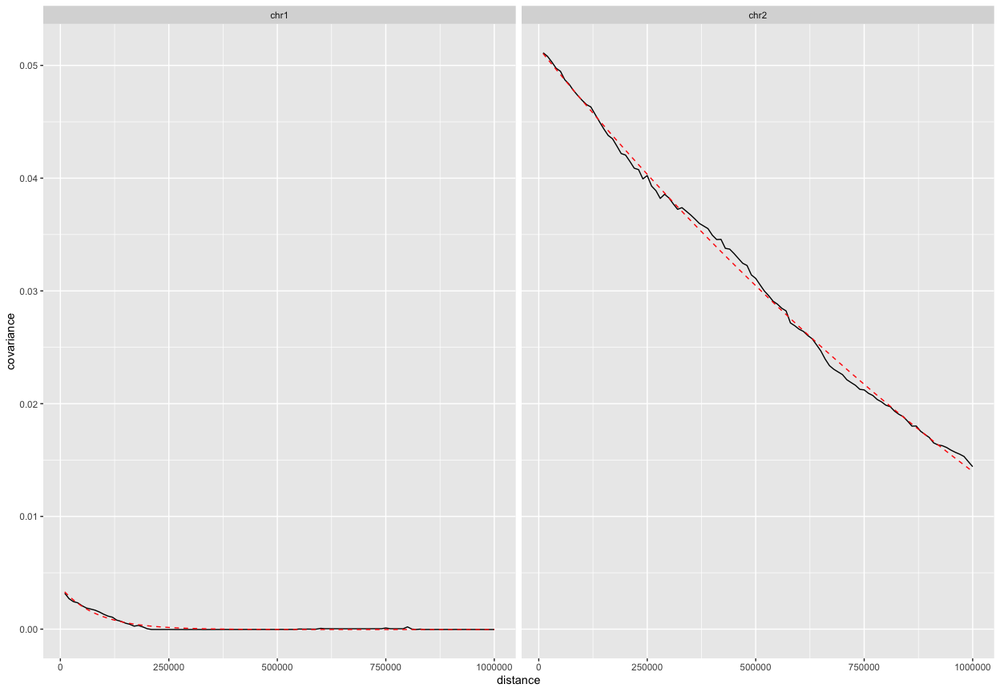
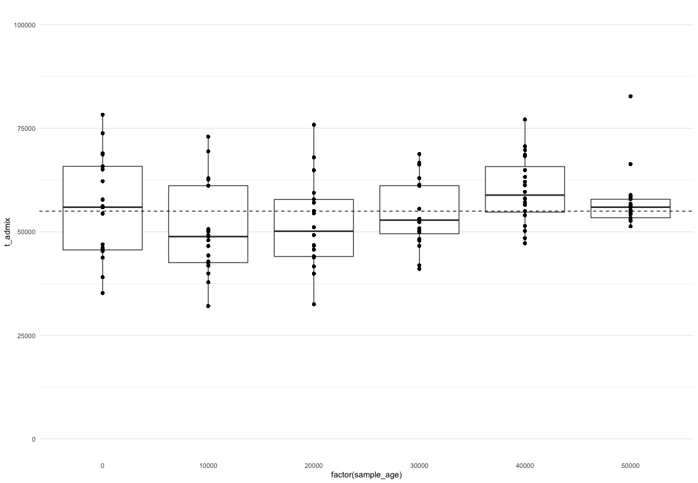
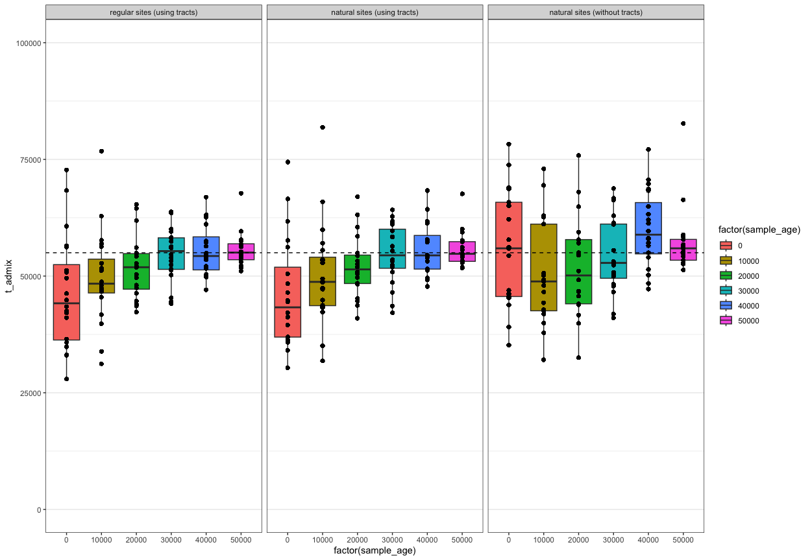

``` r
library(data.table)
library(ggplot2)
library(readr)
library(dplyr)
#> 
#> Attaching package: 'dplyr'
#> The following objects are masked from 'package:data.table':
#> 
#>     between, first, last
#> The following objects are masked from 'package:stats':
#> 
#>     filter, lag
#> The following objects are masked from 'package:base':
#> 
#>     intersect, setdiff, setequal, union
library(tidyr)
library(cowplot)

library(plyranges)
#> Loading required package: BiocGenerics
#> 
#> Attaching package: 'BiocGenerics'
#> The following objects are masked from 'package:dplyr':
#> 
#>     combine, intersect, setdiff, union
#> The following objects are masked from 'package:stats':
#> 
#>     IQR, mad, sd, var, xtabs
#> The following objects are masked from 'package:base':
#> 
#>     anyDuplicated, aperm, append, as.data.frame, basename, cbind,
#>     colnames, dirname, do.call, duplicated, eval, evalq, Filter, Find,
#>     get, grep, grepl, intersect, is.unsorted, lapply, Map, mapply,
#>     match, mget, order, paste, pmax, pmax.int, pmin, pmin.int,
#>     Position, rank, rbind, Reduce, rownames, sapply, setdiff, sort,
#>     table, tapply, union, unique, unsplit, which.max, which.min
#> Loading required package: IRanges
#> Loading required package: S4Vectors
#> Loading required package: stats4
#> 
#> Attaching package: 'S4Vectors'
#> The following object is masked from 'package:tidyr':
#> 
#>     expand
#> The following objects are masked from 'package:dplyr':
#> 
#>     first, rename
#> The following objects are masked from 'package:data.table':
#> 
#>     first, second
#> The following object is masked from 'package:utils':
#> 
#>     findMatches
#> The following objects are masked from 'package:base':
#> 
#>     expand.grid, I, unname
#> 
#> Attaching package: 'IRanges'
#> The following objects are masked from 'package:dplyr':
#> 
#>     collapse, desc, slice
#> The following object is masked from 'package:data.table':
#> 
#>     shift
#> Loading required package: GenomicRanges
#> Loading required package: GenomeInfoDb
#> Warning: package 'GenomeInfoDb' was built under R version 4.3.3
#> 
#> Attaching package: 'plyranges'
#> The following object is masked from 'package:IRanges':
#> 
#>     slice
#> The following objects are masked from 'package:dplyr':
#> 
#>     between, n, n_distinct
#> The following object is masked from 'package:data.table':
#> 
#>     between
#> The following object is masked from 'package:stats':
#> 
#>     filter
library(ggbio)
#> Registered S3 method overwritten by 'GGally':
#>   method from   
#>   +.gg   ggplot2
#> Need specific help about ggbio? try mailing 
#>  the maintainer or visit https://lawremi.github.io/ggbio/
#> 
#> Attaching package: 'ggbio'
#> The following objects are masked from 'package:ggplot2':
#> 
#>     geom_bar, geom_rect, geom_segment, ggsave, stat_bin, stat_identity,
#>     xlim
library(BSgenome.Hsapiens.UCSC.hg19)
#> Loading required package: BSgenome
#> Loading required package: Biostrings
#> Warning: package 'Biostrings' was built under R version 4.3.3
#> Loading required package: XVector
#> 
#> Attaching package: 'Biostrings'
#> The following object is masked from 'package:base':
#> 
#>     strsplit
#> Loading required package: BiocIO
#> Loading required package: rtracklayer
#> 
#> Attaching package: 'rtracklayer'
#> The following object is masked from 'package:BiocIO':
#> 
#>     FileForFormat

library(slendr)
#> 
#> Attaching package: 'slendr'
#> The following objects are masked from 'package:GenomicRanges':
#> 
#>     distance, resize, subtract
#> The following objects are masked from 'package:IRanges':
#> 
#>     distance, resize
init_env()
#> The interface to all required Python modules has been activated.

suppressPackageStartupMessages(source(here::here("utils.R")))
```

Parameters from the simulation:

``` r
gen_time <- 27
t_admix <- round(55000 / gen_time) * gen_time
```

## Read simulated admixture tracts

``` r
tracts_df <-
  read_tsv("data/sim_tracts.tsv") %>%
  group_by(name) %>%
  mutate(haplotype = dense_rank(node_id),
         chrom = paste0("chr", haplotype)) %>%
  ungroup()
#> Rows: 4280 Columns: 7
#> ── Column specification ────────────────────────────────────────────────────────
#> Delimiter: "\t"
#> chr (2): name, pop
#> dbl (5): sample_age, node_id, left, right, length
#> 
#> ℹ Use `spec()` to retrieve the full column specification for this data.
#> ℹ Specify the column types or set `show_col_types = FALSE` to quiet this message.

tracts_df
#> # A tibble: 4,280 × 9
#>    name  sample_age pop   node_id     left    right  length haplotype chrom
#>    <chr>      <dbl> <chr>   <dbl>    <dbl>    <dbl>   <dbl>     <int> <chr>
#>  1 EUR_1      50000 EUR         0 19127220 19527944  400724         1 chr1 
#>  2 EUR_1      50000 EUR         0 50960983 51219943  258960         1 chr1 
#>  3 EUR_1      50000 EUR         0 54542568 55565589 1023021         1 chr1 
#>  4 EUR_1      50000 EUR         0 59782108 59938917  156809         1 chr1 
#>  5 EUR_1      50000 EUR         0 95275454 96092356  816902         1 chr1 
#>  6 EUR_1      50000 EUR         1   482833   887166  404333         2 chr2 
#>  7 EUR_1      50000 EUR         1  9178348  9191865   13517         2 chr2 
#>  8 EUR_1      50000 EUR         1 47755037 48715368  960331         2 chr2 
#>  9 EUR_1      50000 EUR         1 62276039 62914084  638045         2 chr2 
#> 10 EUR_1      50000 EUR         1 84342084 84432573   90489         2 chr2 
#> # ℹ 4,270 more rows
```

``` r
tracts_gr <- tracts_df %>%
  makeGRangesFromDataFrame(
    start.field = "left",
    end.field = "right",
    keep.extra.columns = TRUE,
    ignore.strand = TRUE,
    starts.in.df.are.0based = TRUE
  )
```

``` r
seqlengths(tracts_gr) <- rep(100e6, 2)
```

``` r
tracts_gr
#> GRanges object with 4280 ranges and 6 metadata columns:
#>          seqnames            ranges strand |        name sample_age         pop
#>             <Rle>         <IRanges>  <Rle> | <character>  <numeric> <character>
#>      [1]     chr1 19127221-19527944      * |       EUR_1      50000         EUR
#>      [2]     chr1 50960984-51219943      * |       EUR_1      50000         EUR
#>      [3]     chr1 54542569-55565589      * |       EUR_1      50000         EUR
#>      [4]     chr1 59782109-59938917      * |       EUR_1      50000         EUR
#>      [5]     chr1 95275455-96092356      * |       EUR_1      50000         EUR
#>      ...      ...               ...    ... .         ...        ...         ...
#>   [4276]     chr2 84174414-84347352      * |      EUR_60          0         EUR
#>   [4277]     chr2 84385266-84501788      * |      EUR_60          0         EUR
#>   [4278]     chr2 86999164-87004998      * |      EUR_60          0         EUR
#>   [4279]     chr2 96215189-96313082      * |      EUR_60          0         EUR
#>   [4280]     chr2 96935176-96957114      * |      EUR_60          0         EUR
#>            node_id    length haplotype
#>          <numeric> <numeric> <integer>
#>      [1]         0    400724         1
#>      [2]         0    258960         1
#>      [3]         0   1023021         1
#>      [4]         0    156809         1
#>      [5]         0    816902         1
#>      ...       ...       ...       ...
#>   [4276]       119    172939         2
#>   [4277]       119    116523         2
#>   [4278]       119      5835         2
#>   [4279]       119     97894         2
#>   [4280]       119     21939         2
#>   -------
#>   seqinfo: 2 sequences from an unspecified genome
```

## Admixture dating using regularly-spaced loci

### Define regularly spaced ancestry-informative sites

``` r
interval <- 10e3

sites_grl <- generate_info_sites(tracts_gr, interval = interval)
distances <- seq(interval, 1e6, by = interval)

file <- "dating_LD_pairs_tracts_regular.rds"
if (file.exists(file)) {
  pairs <- readRDS(file)
} else {
  tstart <- Sys.time()

  pairs <- collect_pairs(sites_grl[1], distances)
  pairs <- lapply(seqlevels(sites_grl), function(chr) pairs[[1]])
  names(pairs) <- seqlevels(sites_grl)
  
  tend <- Sys.time()

  print(tend - tstart)
  saveRDS(pairs, file)
}
```

### Compute covariance in all individuals

``` r
length_cutoff <- 0

cov_reg_df <- compute_tract_covariances(filter(tracts_gr, length > length_cutoff), sites_grl, pairs)
```

``` r
cov_reg_df %>%
ggplot() +
  geom_line(aes(distance, covariance, color = factor(sample_age), group = interaction(chrom, name))) +
  facet_grid(~ sample_age) +
  coord_cartesian(xlim = c(0, max(distances)), ylim = c(0, 0.1)) +
  theme(legend.position = "bottom")
```

<!-- -->

``` r
tracts_gr %>%
filter(length > length_cutoff) %>%
as_tibble %>%
ggplot() +
  geom_density(aes(length, color = factor(sample_age), group = name)) +
  facet_grid(. ~ sample_age) +
  coord_cartesian(xlim = c(0, max(distances)))
```

<!-- -->

``` r
chrom <- "chr1"
name <- "EUR_10"

sites_gr <- sites_grl[seqlevels(sites_grl) == chrom, ] %>% unlist
ind_tracts_gr <- tracts_gr %>% filter(name == !!name, seqnames == chrom)
ind_sites_gr <- sites_gr

# mark sites falling within an introgressed tract
tract_overlaps <- queryHits(findOverlaps(ind_sites_gr, ind_tracts_gr))
mcols(ind_sites_gr)$neand <- FALSE
mcols(ind_sites_gr[tract_overlaps])$neand <- TRUE
mcols(ind_sites_gr)$neand <- as.integer(mcols(ind_sites_gr)$neand)
    
ggplot() +
  geom_rect(data = as.data.frame(ind_tracts_gr), aes(xmin = start, xmax = end, ymin = 0.1, ymax = 1.5), fill = "blue") +
  geom_point(data = as.data.frame(filter(ind_sites_gr, neand == 1)), aes(x = start, y = 0.05), size = 0.1, color = "black") +
  geom_point(data = as.data.frame(ind_sites_gr), aes(x = start, y = 0), size = 0.1, alpha = 0.05) +
  scale_x_continuous(labels = scales::comma) +
  expand_limits(x = 0) +
  theme_minimal() +
  theme(axis.text.y = element_blank(), axis.title.y = element_blank(), axis.ticks.y = element_blank(), panel.grid = element_blank())
```

<!-- -->

### Fitting exponential distribution to covariances

<!-- ```{r} -->
<!-- sample_age <- 40000 -->
<!-- name <- sample(filter(cov_df, sample_age == !!sample_age)$name, 1) -->
<!-- chrom <- sample(filter(cov_df, sample_age == !!sample_age)$chrom, 1) -->
<!-- gen_time <- 27 -->
<!-- r <- 1e-8 -->
<!-- data_df <- filter(cov_df, name == !!name, chrom == !!chrom) #sample_age == !!sample_age) -->
<!-- # nls_res <- nls(covariance ~ exp(-lambda * distance * r) + c,  -->
<!-- #                data = data_df,  start = list(A = 1, lambda = 1/50000, c = 0)) -->
<!-- nls_res <- nls(covariance ~ SSasymp(distance, Asym, R0, lrc), data = data_df) -->
<!-- summary(nls_res) -->
<!-- plot(data_df$distance, data_df$covariance) -->
<!-- y_nls <- predict(nls_res, newdata = data_df[, c("sample_age", "distance")]) %>% as.vector -->
<!-- lines(data_df$distance, y_nls) -->
<!-- lambda_nls <- exp(coef(nls_res)["lrc"]) -->
<!-- (t_gens_nls <- lambda_nls / r) -->
<!-- (t_nls <- t_gens_nls * gen_time + sample_age) -->
<!-- ``` -->

``` r
fit_reg_df <- fit_exponential(cov_reg_df)
```

``` r
sample_age <- 30000
name <- sample(filter(cov_reg_df, sample_age == !!sample_age)$name, 1)

ind_cov_df <- filter(cov_reg_df, name == !!name)
ind_fit_df <- filter(fit_reg_df, name == !!name)

ggplot() +
  geom_line(data = ind_cov_df, aes(distance, covariance)) +
  geom_line(data = ind_fit_df, aes(distance, covariance), color = "red", linetype = "dashed") +
  facet_wrap(~ chrom)
```

<!-- -->

``` r
fit_reg_df %>%
ggplot(aes(factor(sample_age), t_admix, group = sample_age)) +
  geom_boxplot() +
  geom_point() +
  geom_hline(yintercept = t_admix, linetype = "dashed") +
  coord_cartesian(ylim = c(0, 100e3)) +
  theme_minimal() +
  theme(panel.grid.major.x = element_blank(), panel.grid.minor.x = element_blank())
```

<!-- -->

## Admixture dating using genotype data (tracts)

### Define archaic ancestry-informative sites

``` r
model <- read_model("dating_model")
ts <- ts_load("dating.trees", model = model)

gt <- ts_genotypes(ts) %>% setDT()
#> 530 multiallelic sites (0.134% out of 395641 total) detected and removed
names(gt) <- gsub("_chr", "_hap", names(gt))
```

``` r
fixed_afr <- gt[, rowMeans(.SD) == 0, .SDcols = patterns("^AFR")]
fixed_neand <- gt[, rowMeans(.SD) == 1, .SDcols = patterns("^NEA")]
fixed_sites <- fixed_afr & fixed_neand

gt <- gt[fixed_sites]
gt <- gt[, .SD, .SDcols = !patterns("^AFR")]
sites_ir <- IRanges(start = gt$pos, end = gt$pos, index = 1:sum(fixed_sites))
```

``` r
sites_grl <- GRangesList(list(GRanges(seqnames = "chr1", sites_ir), GRanges(seqnames = "chr2", sites_ir)))
seqlevels(sites_grl) <- seqlevels(tracts_gr)
seqlengths(sites_grl) <- seqlengths(tracts_gr)
```

``` r
interval <- 10e3
distances <- seq(interval, 1e6, by = interval)

file <- "dating_LD_pairs_tracts_mutations.rds"
if (file.exists(file)) {
  pairs <- readRDS(file)
} else {
  tstart <- Sys.time()

  pairs <- collect_pairs(sites_grl[1], distances)
  pairs <- lapply(seqlevels(sites_grl), function(chr) pairs[[1]])
  names(pairs) <- seqlevels(sites_grl)
  
  tend <- Sys.time()

  print(tend - tstart)
  saveRDS(pairs, file)
}
```

``` r
length_cutoff <- 0

cov_mut_df <- compute_tract_covariances(filter(tracts_gr, length > length_cutoff), sites_grl, pairs)
```

``` r
cov_mut_df %>%
ggplot() +
  geom_line(aes(distance, covariance, color = factor(sample_age), group = interaction(chrom, name))) +
  facet_grid(~ sample_age) +
  coord_cartesian(xlim = c(0, max(distances)), ylim = c(0, 0.1)) +
  theme(legend.position = "bottom")
```

<!-- -->

### Fitting exponential distribution to covariances

``` r
fit_mut_df <- fit_exponential(cov_mut_df)
```

``` r
sample_age <- 30000
name <- sample(filter(fit_mut_df, sample_age == !!sample_age)$name, 1)

ind_cov_df <- filter(cov_mut_df, name == !!name)
ind_fit_df <- filter(fit_mut_df, name == !!name)

ggplot() +
  geom_line(data = ind_cov_df, aes(distance, covariance)) +
  geom_line(data = ind_fit_df, aes(distance, covariance), color = "red", linetype = "dashed") +
  facet_wrap(~ chrom)
```

<!-- -->

``` r
fit_mut_df %>%
ggplot(aes(factor(sample_age), t_admix, group = sample_age)) +
  geom_boxplot() +
  geom_point() +
  geom_hline(yintercept = t_admix, linetype = "dashed") +
  coord_cartesian(ylim = c(0, 100e3)) +
  theme_minimal() +
  theme(panel.grid.major.x = element_blank(), panel.grid.minor.x = element_blank())
```

<!-- -->

## Dating admixture using genotype data (info sites)

### Define archaic ancestry-informative sites

``` r
model <- read_model("dating_model")
ts <- ts_load("dating.trees", model = model)
metadata <- ts_samples(ts) %>% dplyr::rename(sample_age = time)

gt <- ts_genotypes(ts) %>% setDT()
#> 530 multiallelic sites (0.134% out of 395641 total) detected and removed
names(gt) <- gsub("_chr", "_hap", names(gt))
```

``` r
fixed_afr <- gt[, rowMeans(.SD) == 0, .SDcols = patterns("^AFR")]
fixed_neand <- gt[, rowMeans(.SD) == 1, .SDcols = patterns("^NEA")]
fixed_sites <- fixed_afr & fixed_neand

gt <- gt[fixed_sites, .SD, .SDcols = !patterns("^AFR")]
sites_ir <- IRanges(start = gt$pos, end = gt$pos, index = 1:sum(fixed_sites))
```

``` r
sites_grl <- GRangesList(list(GRanges(seqnames = "chr1", sites_ir), GRanges(seqnames = "chr2", sites_ir)))
seqlevels(sites_grl) <- seqlevels(tracts_gr)
seqlengths(sites_grl) <- seqlengths(tracts_gr)
```

``` r
interval <- 10e3
distances <- seq(interval, 1e6, by = interval)

file <- "dating_LD_pairs_info_mutations.rds"
if (file.exists(file)) {
  pairs <- readRDS(file)
} else {
  tstart <- Sys.time()

  pairs <- collect_pairs(sites_grl[1], distances)
  pairs <- lapply(seqlevels(sites_grl), function(chr) pairs[[1]])
  names(pairs) <- seqlevels(sites_grl)
  
  tend <- Sys.time()

  print(tend - tstart)
  saveRDS(pairs, file)
}
```

``` r
info_gt <- lapply(seqlevels(sites_grl), function(chrom) {
  hap <- gsub("chr", "", chrom)

  new_gt <- copy(gt)
  new_gt[, chrom := chrom]

  ind_names <- grep(paste0("_hap", hap, "$"), names(gt), value = TRUE)
  cols <- c("chrom", "pos", ind_names)
  new_gt <- new_gt[, .SD, .SDcols = cols]

  names(new_gt) <- gsub("_hap\\d", "", names(new_gt))

  new_gt
}) %>%
  do.call(rbind, .)

cov_info_df <- compute_match_covariances(info_gt, pairs, metadata)
```

``` r
cov_info_df %>%
ggplot() +
  geom_line(aes(distance, covariance, color = factor(sample_age), group = interaction(chrom, name))) +
  facet_grid(~ sample_age) +
  coord_cartesian(xlim = c(0, max(distances)), ylim = c(0, 0.1)) +
  theme(legend.position = "bottom")
```

<!-- -->

### Fitting exponential distribution to covariances

``` r
fit_info_df <- fit_exponential(cov_info_df)
```

``` r
sample_age <- 10000
name <- sample(filter(fit_mut_df, sample_age == !!sample_age)$name, 1)

ind_cov_df <- filter(cov_info_df, name == !!name)
ind_fit_df <- filter(fit_info_df, name == !!name)

ggplot() +
  geom_line(data = ind_cov_df, aes(distance, covariance)) +
  geom_line(data = ind_fit_df, aes(distance, covariance), color = "red", linetype = "dashed") +
  facet_wrap(~ chrom)
```

<!-- -->

``` r
fit_info_df %>%
ggplot(aes(factor(sample_age), t_admix, group = sample_age)) +
  geom_boxplot() +
  geom_point() +
  geom_hline(yintercept = t_admix, linetype = "dashed") +
  coord_cartesian(ylim = c(0, 100e3)) +
  theme_minimal() +
  theme(panel.grid.major.x = element_blank(), panel.grid.minor.x = element_blank())
```

<!-- -->

## Comparison of exponential fits

``` r
cov_df <- rbind(
  mutate(cov_reg_df, method = "pairwise regular tracts"),
  mutate(cov_mut_df, method = "pairwise info tracts"),
  mutate(cov_info_df, method = "pairwise info")
)
```

``` r
cov_df %>%
group_by(method, sample_age, distance) %>%
summarise(covariance = mean(covariance)) %>%
ggplot() +
  geom_line(aes(distance, covariance, color = factor(method))) +
  facet_grid(~ sample_age) +
  coord_cartesian(xlim = c(0, max(distances))) +
  theme(legend.position = "bottom")
#> `summarise()` has grouped output by 'method', 'sample_age'. You can override
#> using the `.groups` argument.
```

<!-- -->

``` r
fit_df <- rbind(
  mutate(fit_reg_df, method = "pairwise regular tracts"),
  mutate(fit_mut_df, method = "pairwise info tracts"),
  mutate(fit_info_df, method = "pairwise info")
)
```

``` r
fit_df %>%
ggplot(aes(factor(sample_age), t_admix, group = sample_age)) +
  geom_boxplot(aes(fill = factor(sample_age))) +
  geom_point() +
  geom_hline(yintercept = t_admix, linetype = "dashed") +
  coord_cartesian(ylim = c(0, 100e3)) +
  theme_bw() +
  theme(panel.grid.major.x = element_blank(), panel.grid.minor.x = element_blank()) +
  facet_wrap(~ method)
```

<!-- -->

## Empirical data

<!-- ```{r} -->
<!-- metadata <- read_metadata() -->
<!-- tracts_df <- rbind(read_tracts("Modern"), read_tracts("Ancient")) -->
<!-- tracts_df <- select(metadata, name = sampleId, ageAverage, coverage) %>% -->
<!--   inner_join(tracts_df, by = c("name" = "ID")) %>% -->
<!--   dplyr::rename(left = start, right = end) -->
<!-- tracts_df <- tracts_df %>% filter(name == "Kostenki") %>% arrange(chrom, left, right) -->
<!-- tracts_df$chrom_id <- tracts_df$chrom -->
<!-- ``` -->
<!-- ```{r} -->
<!-- seqlengths(tracts_gr) <- seqlengths(BSgenome.Hsapiens.UCSC.hg19)[names(seqlengths(tracts_gr))] -->
<!-- genome(tracts_gr) <- "hg19" -->
<!-- ``` -->
