``` r
library(ggplot2)
library(readr)
library(dplyr)
#> 
#> Attaching package: 'dplyr'
#> The following objects are masked from 'package:stats':
#> 
#>     filter, lag
#> The following objects are masked from 'package:base':
#> 
#>     intersect, setdiff, setequal, union
library(tidyr)
library(Metrics)

library(slendr)
init_env(quiet = TRUE)

suppressPackageStartupMessages(source(here::here("utils.R")))
#> Warning: package 'GenomeInfoDb' was built under R version 4.3.3
```

## Testing the admixture dating methodology on simulations

``` r
anc <- population("ancestor", N = 10000, time = 1000000, remove = 649000)
afr <- population("AFR", parent = anc, N = 10000, time = 650000)
nea <- population("NEA", parent = anc, N = 2000, time = 650000)
eur <- population("EUR", parent = afr, N = 5000, time = 80000)

# https://www.science.org/doi/full/10.1126/sciadv.abm7047
gen_time <- 27
t_admix <- round(55000 / gen_time) * gen_time

gf <- gene_flow(from = nea, to = eur, rate = 0.03, start = t_admix, end = t_admix - gen_time)

model <- compile_model(
  populations = list(anc, afr, nea, eur), gene_flow = gf,
  generation_time = gen_time,
  path = "data/dating_model", overwrite = TRUE, force = TRUE
)

samples <- rbind(
  schedule_sampling(model, times = 50e3, list(nea, 2)),
  schedule_sampling(model, times = c(50, 40, 30, 20, 10, 0) * 1e3, list(eur, 50)),
  schedule_sampling(model, times = 0, list(afr, 100))
)

plot_model(model, proportions = TRUE, order = c("AFR", "EUR", "ancestor", "NEA"))
```

<!-- -->

``` r
x = Sys.time()
ts <- msprime(model, sequence_length = 500e6, recombination_rate = 1e-8, samples = samples, random_seed = 42) %>%
  ts_mutate(1e-8, random_seed = 42)
y = Sys.time()

tracts <- ts_tracts(ts, census = t_admix, quiet = TRUE)
z = Sys.time()

ts_save(ts, "data/dating.trees")

y-x # Time difference of 25.93642 mins
#> Time difference of 49.55179 mins
z-x # Time difference of 28.25553 mins
#> Time difference of 51.73869 mins
```

``` r
tracts_df <- tracts %>% dplyr::select(-pop, -source_pop, -source_pop_id)

samples_df <- ts_samples(ts) %>% dplyr::rename(sample_age = time)

tracts_df <- inner_join(samples_df, tracts_df, by = "name")

write.table(tracts_df, file = "data/sim_tracts.tsv",
            sep = "\t", row.names = FALSE, col.names = TRUE, quote = FALSE)
```

``` r
tracts_df <- read_tsv("data/sim_tracts.tsv")
#> Rows: 93746 Columns: 7
#> ── Column specification ────────────────────────────────────────────────────────
#> Delimiter: "\t"
#> chr (2): name, pop
#> dbl (5): sample_age, node_id, left, right, length
#> 
#> ℹ Use `spec()` to retrieve the full column specification for this data.
#> ℹ Specify the column types or set `show_col_types = FALSE` to quiet this message.

head(tracts_df)
#> # A tibble: 6 × 7
#>   name  sample_age pop   node_id     left    right length
#>   <chr>      <dbl> <chr>   <dbl>    <dbl>    <dbl>  <dbl>
#> 1 EUR_1      50000 EUR         0  1343336  1485288 141952
#> 2 EUR_1      50000 EUR         0  4452246  4482422  30176
#> 3 EUR_1      50000 EUR         0 10149562 10551372 401810
#> 4 EUR_1      50000 EUR         0 22601814 23058944 457130
#> 5 EUR_1      50000 EUR         0 57431016 57492854  61838
#> 6 EUR_1      50000 EUR         0 61653483 62044482 390999
```

## How does admixture dating work?

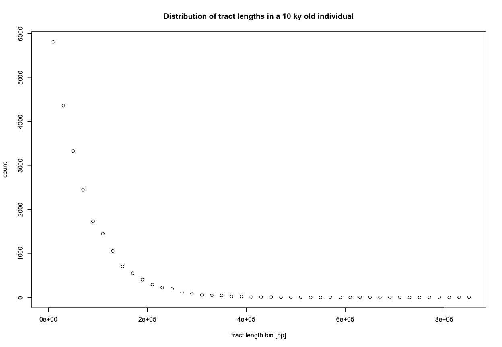<!-- -->

Exponential distribution is governed by the following density function
with a *rate parameter* $\lambda$:

$$
f(\textrm{tract length }~x) \sim \lambda \exp^{-\lambda x}
$$

In the case of exponential decay of admixture tracts and after making
some simplifying assumptions, the $\lambda$ rate parameter can be
parametrized as:

$$
\lambda = \frac{1}{r t},
$$

where $r$ is the recombination rate and $t$ is the time (in generations)
since the admixture event.

The expected value of such exponential distribution is given by:

$$
\mathop{\mathbb{E}} [X] = \frac{1}{\lambda}
$$

Because we can get the MLE of this expectation by computing a simple
mean of tract lengths $\bar{x}$, we can also write:

$$
\bar{x} \approx \mathop{\mathbb{E}} [X] = \frac{1}{\lambda}.
$$

From this, we can therefore get an estimate the rate of exponential
decay $\hat{\lambda}$ as:

$$
\hat{\lambda} = \frac{1}{\bar{x}}
$$

and overlay an exponential function over the histogram using
`dexp(..., rate = <lambda>)` in R:

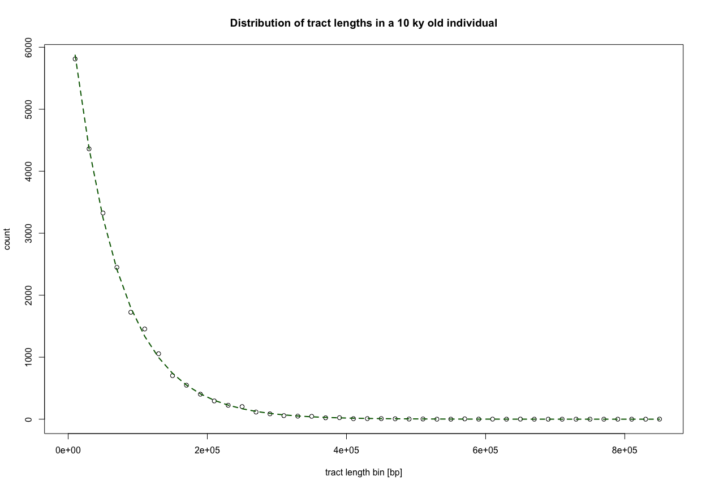<!-- -->

But more importantly, because we know that $\lambda = 1 / (r t)$,
assuming we know the uniform average recombination rate $r$ reasonably
well, we can estimate the time of admixture $t$ as:

$$
t \approx \frac{\hat{\lambda}}{r}
$$

For example, given a vector of tract lengths in this “10 ky old”
simulated individual

``` r
head(tract_lengths, 10)
#>  [1] 138704  58471   3773  19016  35863 128687 113907  12082    801  64642
```

we can compute $\hat{\lambda}$:

``` r
lambda_hat <- 1 / mean(tract_lengths)
lambda_hat
#> [1] 1.480147e-05
```

And get the estimate of time since Neanderthal admixture in the history
of this individual:

``` r
r <- 1e-8 # recombination rate (crossovers per bp per generation)

lambda_hat / r # admixture time in "generations before this individual lived"
#> [1] 1480.147
```

To get the absolute admixture time, we convert generations to years and
add the “radiocarbon date” of this individual:

``` r
lambda_hat / r * gen_time + 10000 # absolute admixture time in "years ago"
#> [1] 49963.96
```

**But what if we have filtered data? Traditionally, tracts are filtered
by removing tracts shorter than a certain cutoff:**

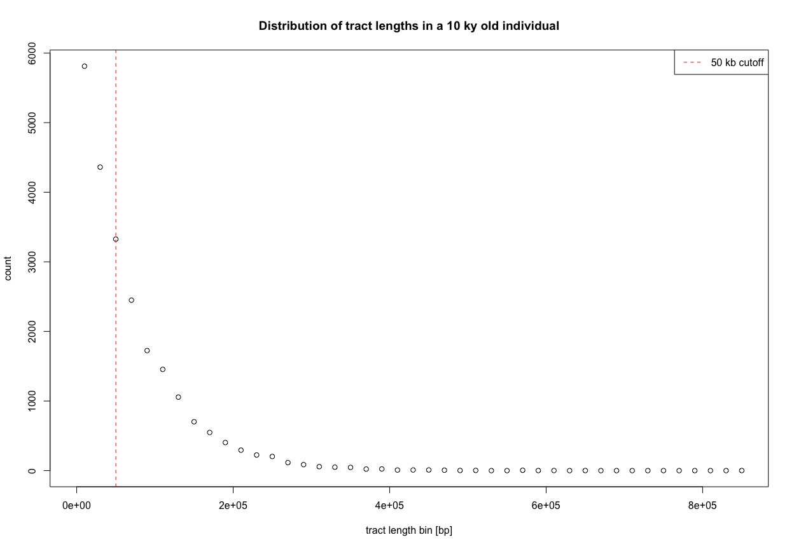<!-- -->

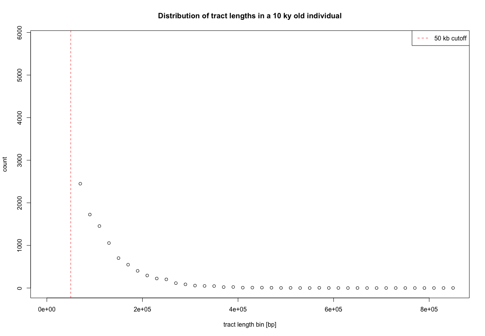<!-- -->

<!-- ```{r} -->
<!-- min_length <- 50e3 -->
<!-- ggplot() + -->
<!--   geom_density(data = tracts_df, -->
<!--                aes(length, y = after_stat(count), color = factor(sample_age), linetype = "unfiltered")) + -->
<!--   geom_density(data = filter(tracts_df, length >= min_length), -->
<!--                aes(length, y = after_stat(count), color = factor(sample_age), linetype = "filtered"), -->
<!--                color = "black") + -->
<!--   guides(color = "none") + -->
<!--   labs(linetype = "tracts") + -->
<!--   scale_linetype_manual(values = c("unfiltered" = "solid", "filtered" = "dashed")) + -->
<!--   facet_wrap(~ sample_age, labeller = labeller(sample_age = function(x) paste("sample age =", x, "kya"))) + -->
<!--   coord_cartesian(xlim = c(0, 1e6)) + -->
<!--   theme_bw() -->
<!-- ``` -->

## Tract-length distributions for different sample ages

**(I.e., different times since Neanderthal introgression.)**

``` r
tracts_df %>%
ggplot() +
  geom_density(aes(length), alpha = 0.2) +
  geom_histogram(
    aes(x = length, y = after_stat(density), fill = as.factor(sample_age)),
    binwidth = 10000, alpha = 0.75
  ) +
  labs(
    x = "tract length [bp]", y = "density", fill = "age of sample",
    title = "Tract length distribution as a function of admixed sample's age"
  ) +
  scale_x_continuous(labels = scales::comma) +
  expand_limits(y = 0) +
  coord_cartesian(xlim = c(0, 2e6), ylim = c(0, 2e-5)) +
  theme_bw() +
  theme(legend.position = "none", text = element_text(size = 15)) +
  facet_wrap(~ sample_age, labeller = labeller(sample_age = function(x) paste("sample age =", x, "kya")))
```

<!-- -->

## Admixture dating in simulated data

### v1 estimate

``` r
# sample_age <- 10e3
# min_length <- 100e3

max_length <- Inf

results_v1 <- list()

pdf("dating_tracts_sims_v1.pdf", width = 14, height = 8)

for (min_length in c(0, 50e3, 100e3, 150e3, 200e3, 250e3, 300e3)) {

  plot(1, type = "n", axes = FALSE, xlab = "", ylab = "", xlim = c(0, 1), ylim = c(0, 1))
  text(0.5, 0.5, paste("Minimum tract length:", as.integer(min_length), "bp"), cex = 3)
  
  for (sample_age in sort(unique(tracts_df$sample_age))) {
    
    # cat("minimum length:", min_length, "\nsample_age:", sample_age, "\n")
    
    r <- 1e-8
    m <- 0.03
    
    filtered_tracts <- tracts_df %>% filter(sample_age == !!sample_age, length >= min_length, length <= max_length)
    
    # bin the tracts, discarding the very first bin due to very frequent bining artifacts
    # (the lowest bin being extremely small, misrepresenting the true distribution of the data)
    bin_data <- hist(filtered_tracts$length, plot = FALSE, breaks = 101)
    density <- bin_data$density[-1]
    length <- bin_data$mids[-1][density > 0]
    density <- density[density > 0]
    
    # lm estimate of admixture time
    #   -- based on log-transformed linear fit of density vs tract length
    lm_res <- lm(log(density) ~ length)
    lambda_lm <- -coef(lm_res)[["length"]]
    if (lambda_lm < 0) lambda_lm <- NA
    
    t_gens_lm <- lambda_lm / r
    t_lm <- t_gens_lm * gen_time + sample_age
    
    # weighted lm estimate of admixture time
    #   -- based on log-transformed linear fit of density vs tract length
    lmw_res <- lm(log(density) ~ length, weights = 1 / length)
    lambda_lmw <- -coef(lmw_res)[["length"]]
    if (lambda_lmw < 0) lambda_lmw <- NA
    
    t_gens_lmw <- lambda_lmw / r
    t_lmw <- t_gens_lmw * gen_time + sample_age
    
    # MLE estimate of admixture time (approximate)
    #  -- based on computing average length as the expectation of the theoretical exponential distribution
    L1 <- mean(filtered_tracts$length)
    lambda_mean1 <- 1 / (L1 - min_length)
    
    t_gens_mean1 <- lambda_mean1 / r
    t_mean1 <- t_gens_mean1 * gen_time + sample_age

    # MLE estimate of admixture time (accurate)
    #  -- based on computing average length as the expectation of the theoretical exponential distribution
    L2 <- mean(filtered_tracts$length)
    lambda_mean2 <- 1 / (L2 - min_length)
    
    t_gens_mean2 <- lambda_mean2 / ((1 - m) * r) + 1
    t_mean2 <- t_gens_mean2 * gen_time + sample_age
    
    # nls estimate -- computing the rate of decay (lambda) by fitting an exponential curve directly
    nls_res <- tryCatch(
      nls(density ~ SSasymp(length, Asym, R0, lrc)),
      error = function(e) NA, warning = function(w) NA
    )
    failed_nls <- !inherits(nls_res, "nls")
    lambda_nls <- if (failed_nls) NA else exp(unname(coef(nls_res)["lrc"]))
    t_gens_nls <- lambda_nls / ((1 - m) * r) + 1
    t_nls <- t_gens_nls * gen_time + sample_age
    
    # plotting
    orig_par <- par(no.readonly = TRUE)
    
    par(mfrow = c(1, 2))
    
    title <- sprintf("sample age %d, tract length [%d kb, %.1f Mb]",
                     sample_age, round(min_length / 1e3, 1), round(max_length / 1e6, 1))
    
    legends <- c(
      sprintf("lm fit: admixture %.1f generations prior ~ %.1f kya", t_gens_lm, round(t_lm / 1e3, 1)),
      sprintf("weighted lm fit: admixture %.1f generations prior ~ %.1f kya", t_gens_lmw, round(t_lmw / 1e3, 1)),
      sprintf("approx MLE fit: admixture %.1f generations prior ~ %.1f kya", t_gens_mean1, round(t_mean1 / 1e3, 1)),
      sprintf("MLE fit: admixture %.1f generations prior ~ %.1f kya", t_gens_mean2, round(t_mean2 / 1e3, 1)),
      sprintf("nls fit: admixture %.1f generations prior ~ %.1f kya", t_gens_nls, round(t_nls / 1e3, 1))
    )
    
    # plot the results on the original exponential scale (although we fit truncated exponential,
    # the rate corresponds to the shape of the original unfiltered exponential function, so we
    # compute dexp() on the original unfiltered x-axis scale for plotting purposes)
    x_values <- sort(unique(c(length, seq(0, max(tracts_df$length), by = 5000))))
    y_lm <- dexp(x_values, rate = lambda_lm)
    y_lmw <- dexp(x_values, rate = lambda_lmw)
    y_mean1 <- dexp(x_values, rate = lambda_mean1)
    y_mean2 <- dexp(x_values, rate = lambda_mean2)
    y_nls <- if (failed_nls) NA else predict(nls_res, newdata = data.frame(length = x_values + min_length))
    
    ylim <- c(min(c(density, y_lm, y_lmw, y_mean1, y_mean2, y_nls), na.rm = TRUE),
              3e-5) #max(c(density, y_lm, y_mean, y_nls), na.rm = TRUE))
    plot(length, density, xlim = c(0, 1e6), main = title, ylim = ylim)
    abline(v = min_length, lty = "dashed")
    lines(x_values + min_length, y_lm, col = "olivedrab4", lty = 2, lwd = 2)
    lines(x_values + min_length, y_lmw, col = "springgreen2", lty = 2, lwd = 2)
    lines(x_values + min_length, y_mean1, col = "red", lty = 2, lwd = 2)
    lines(x_values + min_length, y_mean2, col = "steelblue3", lty = 2, lwd = 2)
    if (!failed_nls)
      lines(x_values + min_length, y_nls, col = "purple", lty = 2, lwd = 2)

    legend("topright", fill = c("olivedrab4", "springgreen2", "red", "steelblue3", "purple"), legend = legends)
    
    # plot the results on the log-transformed scale
    plot(length, log(density), xlim = c(0, 1e6), main = title, ylim = c(-15, -11))
    abline(v = min_length, lty = "dashed")
    abline(lm_res, col = "olivedrab4", lty = 2, lwd = 2)
    abline(lmw_res, col = "springgreen2", lty = 2, lwd = 2)
    abline(a = log(lambda_mean1) + lambda_mean1 * min_length, b = -lambda_mean1, col = "red", lty = 2, lwd = 2)
    abline(a = log(lambda_mean2) + lambda_mean2 * min_length, b = -lambda_mean2, col = "steelblue3", lty = 2, lwd = 2)
    if (!failed_nls)
      suppressWarnings(lines(x_values, log(y_nls), col = "purple", lty = 2, lwd = 2))
    
    legend("topright", fill = c("olivedrab4", "springgreen2", "red", "steelblue3", "purple"), legend = legends)
    
    par(orig_par)
    
    fitted_idx <- match(length, x_values)
    rmse_lm <- rmse(density, y_lm[fitted_idx])
    rmse_lmw <- rmse(density, y_lmw[fitted_idx])
    rmse_mean1 <- rmse(density, y_mean1[fitted_idx])
    rmse_mean2 <- rmse(density, y_mean2[fitted_idx])
    rmse_nls <- rmse(density, y_nls[fitted_idx])
    
    results_v1[[length(results_v1) + 1]] <- tibble(
      sample_age = sample_age,
      min_length = min_length,
      method = c("lm", "lm (weighted)", "approx. MLE", "MLE", "nls"),
      lambda = c(lambda_lm, lambda_lmw, lambda_mean1, lambda_mean2, lambda_nls),
      rmse_density = c(rmse_lm, rmse_lmw, rmse_mean1, rmse_mean2, rmse_nls),
      t_inferred = c(t_lm, t_lmw, t_mean1, t_mean2, t_nls),
      ratio_time = t_inferred / t_admix
    )
  
  }
}

dev.off()
#> quartz_off_screen 
#>                 2

results_v1_df <- do.call(rbind, results_v1)
```

``` r
p_density <- results_v1_df %>%
  ggplot(aes(as.factor(sample_age), rmse_density, color = method)) +
    geom_point() +
    geom_line(aes(group = method)) +
    theme_bw() +
    theme(text = element_text(size = 15)) +
    xlab("sample age [years ago]") +
    ylab("RMSE observed vs fitted tract length density") +
    facet_wrap(~ min_length, nrow = 1,
               labeller = labeller(min_length = function(x) paste("minimum segment length =", as.integer(x) / 1e3, "kb")))

p_time <- results_v1_df %>%
  ggplot(aes(as.factor(sample_age), ratio_time, color = method)) +
    geom_point() +
    geom_line(aes(group = method)) +
    geom_hline(yintercept = 1, linetype = "dashed") +
    coord_cartesian(ylim = c(0.6, 1.4)) +
    theme_bw() +
    theme(text = element_text(size = 15)) +
    xlab("sample age [years ago]") +
    ylab("inferred / true admixture time") +
    facet_wrap(~ min_length, nrow = 1,
               labeller = labeller(min_length = function(x) paste("minimum segment length =", as.integer(x) / 1e3, "kb")))

cowplot::plot_grid(p_density, p_time, nrow = 2)
```

<!-- -->

**Note:** The stricter the minimum length cutoff, the higher the RMSE of
a fit against the real data, and this is worse the younger the sample
is. This is because young samples have the highest proportion of very
short tracts (and very few longer tracts), so the exponential decay data
is actually the noisiest, and the fit is necessarily poorer. It’s the
opposite for the oldest samples, which have much fewer short tracts (so
the distribution is less affected by filtering for minimum length) and
many more longer tracts (which are not affected by filtering at all).

``` r
p_density2 <- results_v1_df %>%
  ggplot(aes(method, rmse_density)) +
  geom_boxplot(aes(color = method)) +
  geom_jitter() +
  expand_limits(y = 0) +
  theme_bw() +
  theme(text = element_text(size = 15)) +
  facet_wrap(
    ~ min_length, nrow = 1,
    labeller = labeller(min_length = function(x) paste("minimum tract length =", as.integer(x) / 1e3, "kb"))
  )

p_time2 <- results_v1_df %>%
  ggplot(aes(method, ratio_time)) +
  geom_boxplot(aes(color = method)) +
  geom_jitter() +
  geom_hline(yintercept = 1, linetype = "dashed") +
  theme_bw() +
  theme(text = element_text(size = 15)) +
  facet_wrap(
    ~ min_length, nrow = 1,
    labeller = labeller(min_length = function(x) paste("minimum tract length =", as.integer(x) / 1e3, "kb"))
  )

cowplot::plot_grid(p_density2, p_time2, nrow = 2)
```

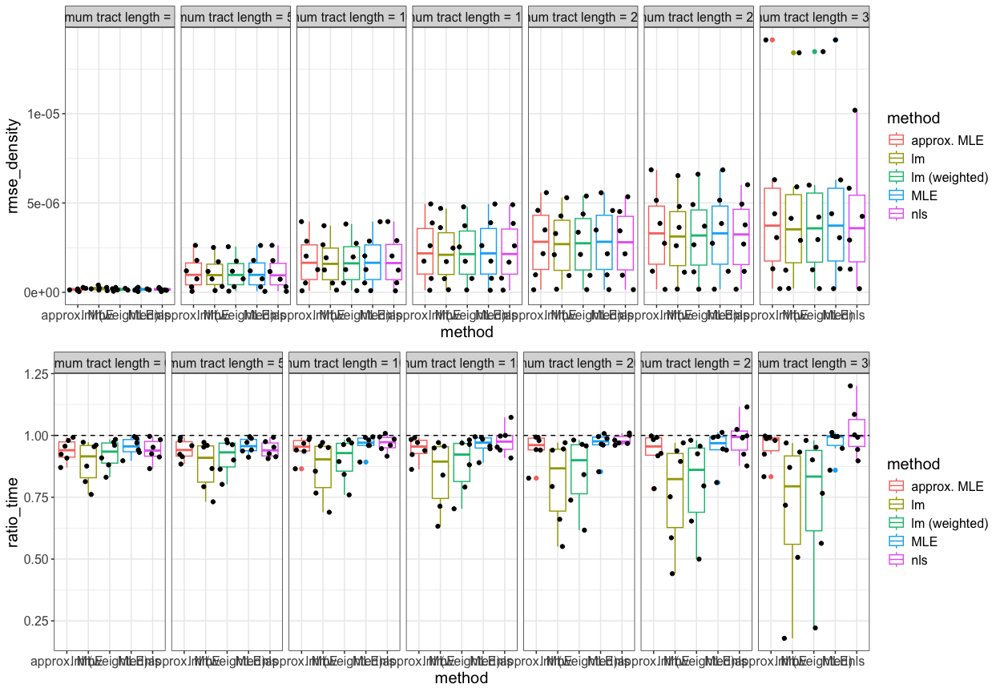<!-- -->

### v2 (MLE) estimate

``` r
# min_length <- 0

pdf("dating_tracts_sims_v2_mle.pdf", width = 12, height = 8)

results_v2_mle <- list()

max_length <- Inf

for (min_length in c(0, 50e3, 100e3, 150e3, 200e3, 250e3, 300e3)) {
  tracts_filt_df <- tracts_df %>% filter(length >= min_length, length <= max_length)

  p_tracts <-
    ggplot() +
    geom_histogram(
      data = tracts_filt_df, aes(x = length, y = after_stat(density), fill = as.factor(sample_age)),
      binwidth = 10000, alpha = 0.75) +
    # geom_density(
    #   data = tracts_filt_df, aes(x = length, y = after_stat(density), fill = as.factor(sample_age)),
    #   bw = 5000, alpha = 0.75, color = FALSE) +
    labs(
      x = "tract length [bp]", y = "density", fill = "age of sample",
      title = "Tract length distribution as a function of admixed sample's age",
      subtitle = paste0(
        "(assuming single-pulse admixture at ~ 55 kya, tract length [",
        as.integer(min_length / 1e3), " kb, ", max_length / 1e6," Mb])"
      )
    ) +
    scale_x_continuous(labels = scales::comma) +
    expand_limits(y = 0, x = 0) +
    coord_cartesian(ylim = c(0, 2e-5)) +
    theme_minimal() +
    theme(legend.position = "none", text = element_text(size = 15)) +
    facet_wrap(~ sample_age, labeller = labeller(sample_age = function(x) paste("sample age =", x, "kya")))
  
  r <- 1e-8
  m <- 0.03
  
  exp_df <- group_by(tracts_filt_df, sample_age) %>%
    summarise(L = mean(length)) %>%
    mutate(
      lambda = 1 / (L - min_length),
      t_gen = lambda / ((1 - m) * r) + 1,
      t_before = t_gen * gen_time,
      t_inferred = t_before + sample_age
    )
  
  exp_decay <- function(lambda, max) {
    data.frame(length = seq(0, max, by = 1000)) %>%
      mutate(density = dexp(length, rate = lambda))
  }
  
  predictions_df <-
    exp_df %>%
    select(sample_age, lambda) %>%
    rowwise() %>%
    mutate(exp_data = list(exp_decay(lambda, max(tracts_filt_df$length)))) %>%
    unnest(cols = c(exp_data)) %>%
    select(-lambda)
  
  p_fit <- p_tracts +
    geom_line(data = predictions_df, aes(x = length + min_length, y = density),
              linetype = "dashed", linewidth = 0.75, color = "black") +
    geom_text(data = exp_df,
              aes(x = Inf, y = Inf, color = as.factor(sample_age),
                  label = paste0(
                    "estimated admixture at ", round(t_inferred / 1e3, 1), " kya\n",
                    "(", round(t_gen), " generations prior)"
                  )),
              hjust = 1.2, vjust = 8, size = 4)
  
  print(p_fit)
  
  results_v2_mle[[length(results_v2_mle) + 1]] <- exp_df %>% mutate(min_length = min_length)
}

dev.off()
#> quartz_off_screen 
#>                 2

results_v2_mle_df <- do.call(rbind, results_v2_mle)
```

``` r
inner_join(
  filter(results_v1_df, method == "MLE") %>% select(sample_age, min_length, t_inferred),
  select(results_v2_mle_df, sample_age, min_length, t_inferred),
  by = c("sample_age", "min_length")
) %>%
  mutate(equal = t_inferred.x == t_inferred.y) %>%
  .$equal %>%
  all()
#> [1] TRUE
```

### v2 (NLS) estimate

``` r
# min_length <- 0

pdf("dating_tracts_sims_v2_nls.pdf", width = 12, height = 8)

results_v2_nls <- list()

max_length <- Inf

for (min_length in c(0, 50e3, 100e3, 150e3, 200e3, 250e3, 300e3)) {
  tracts_filt_df <- tracts_df %>% filter(length >= min_length, length <= max_length)
    
  age_bins <-
    tibble(sample_age = unique(tracts_filt_df$sample_age)) %>%
    mutate(bins = lapply(sample_age, function(x) {
      # bin the tracts, discarding the very first bin due to very frequent bining artifacts
      # (the lowest bin being extremely small, misrepresenting the true distribution of the data)
      bin_data <- hist(filter(tracts_filt_df, sample_age == x)$length, plot = FALSE, breaks = 101)
      density <- bin_data$density[-1]
      length <- bin_data$mids[-1][density > 0]
      density <- density[density > 0]
      tibble(length, density)
    })) %>% unnest(bins)


  p_tracts <-
    ggplot() +
    geom_histogram(
      data = tracts_filt_df, aes(x = length, y = after_stat(density), fill = as.factor(sample_age)),
      binwidth = 10000, alpha = 0.75) +
    # geom_density(
    #   data = tracts_filt_df, aes(x = length, y = after_stat(density), fill = as.factor(sample_age)),
    #   bw = 5000, alpha = 0.75, color = FALSE) +
    labs(
      x = "tract length [bp]", y = "density", fill = "age of sample",
      title = "Tract length distribution as a function of admixed sample's age",
      subtitle = paste0(
        "(assuming single-pulse admixture at ~ 55 kya, tract length [",
        as.integer(min_length / 1e3), " kb, ", max_length / 1e6," Mb])"
      )
    ) +
    scale_x_continuous(labels = scales::comma) +
    expand_limits(y = 0, x = 0) +
    coord_cartesian(ylim = c(0, 2e-5)) +
    theme_minimal() +
    theme(legend.position = "none", text = element_text(size = 15)) +
    facet_wrap(~ sample_age, labeller = labeller(sample_age = function(x) paste("sample age =", x, "kya")))
  
  m <- 0.03

  fit_df <- lapply(unique(age_bins$sample_age),
      function(x) {
        bin_df <- filter(age_bins, sample_age == x)
        nls_res <- tryCatch(
          nls(density ~ SSasymp(length, Asym, R0, lrc), data = bin_df),
          error = function(e) NA, warning = function(w) NA
        )
        failed_nls <- !inherits(nls_res, "nls")
        lambda_nls <- if (failed_nls) NA else exp(unname(coef(nls_res)["lrc"]))
        t_gens_nls <- lambda_nls / ((1 - m) * r) + 1
        t_nls <- t_gens_nls * gen_time + x
        y_nls <- if (failed_nls) NA else predict(nls_res, newdata = data.frame(length = x_values + min_length))
        tibble(sample_age = x,
               t_inferred = t_nls,
               t_gen = t_gens_nls,
               fit = list(tibble(length = x_values + min_length, density = y_nls)))
      }
    ) %>% do.call(rbind, .)
  
  p_fit <- p_tracts +
    geom_line(data = unnest(fit_df, fit), aes(x = length, y = density), linetype = "dashed") +
    geom_text(data = fit_df,
              aes(x = Inf, y = Inf, color = as.factor(sample_age),
                  label = paste0(
                    "estimated admixture at ", round(t_inferred / 1e3, 1), " kya\n",
                    "(", round(t_gen), " generations prior)"
                  )),
              hjust = 1.2, vjust = 8, size = 4)
  


  print(p_fit)
  
  results_v2_nls[[length(results_v2_nls) + 1]] <- fit_df %>% mutate(min_length = min_length)
}

dev.off()
#> quartz_off_screen 
#>                 2

results_v2_nls_df <- do.call(rbind, results_v2_nls)
```

``` r
inner_join(
  filter(results_v1_df, method == "nls") %>% select(sample_age, min_length, t_inferred),
  select(results_v2_nls_df, sample_age, min_length, t_inferred),
  by = c("sample_age", "min_length")
) %>%
  mutate(equal = t_inferred.x == t_inferred.y) %>%
  .$equal %>%
  all()
#> [1] TRUE
```

### Individual-based NLS estimates

``` r
min_length <- 50e3

results_ind <- list()

max_length <- Inf

all_inds <- tracts_df %>% arrange(-sample_age) %>% pull(name) %>% unique

pdf("dating_tracts_sim_inds.pdf", width = 12, height = 8)

for (i in seq_along(all_inds)) {
  ind <- all_inds[i]
  # cat(sprintf("Processing individual %s [%d/%d]\n", ind, i, length(all_inds)))

  ind_tracts_df <- filter(tracts_df, length >= min_length, name == ind)
  sample_age <- ind_tracts_df$sample_age[1]

  p_tracts <-
    ggplot() +
    geom_histogram(
      data = ind_tracts_df, aes(x = length, y = after_stat(density)),
      binwidth = 10000, alpha = 0.75) +
    # geom_density(
    #   data = tracts_filt_df, aes(x = length, y = after_stat(density), fill = as.factor(sample_age)),
    #   bw = 5000, alpha = 0.75, color = FALSE) +
    labs(
      x = "tract length [bp]", y = "density", fill = "age of sample",
      title = "Distribution of introgressed tracts",
      subtitle = paste0("name: ", ind, ", date: ", sample_age," years BP")
    ) +
    scale_x_continuous(labels = scales::comma) +
    expand_limits(y = 0, x = 0) +
    coord_cartesian(xlim = c(0, 2e6), ylim = c(0, 2e-5)) +
    theme_minimal() +
    theme(legend.position = "none", text = element_text(size = 15),
          axis.text.x = element_text(hjust = 1, angle = 45))
  
  bin_data <- hist(ind_tracts_df$length, plot = FALSE, breaks = 101)
  density <- bin_data$density[-1]
  length <- bin_data$mids[-1][density > 0]
  density <- density[density > 0]
  data_df <- tibble(length, density)

  r <- 1e-8
  m <- 0.03

  # nls estimate -- computing the rate of decay (lambda) by fitting an exponential curve directly
  # https://www.rdocumentation.org/packages/stats/versions/3.6.2/topics/SSasymp 
  nls_res <- tryCatch(
    nls(density ~ SSasymp(length, Asym, R0, lrc)), data = data_df,
    error = function(e) NA, warning = function(w) NA
  )
  failed_nls <- !inherits(nls_res, "nls")
  lambda <- if (failed_nls) 1 / mean(ind_tracts_df$length) else exp(unname(coef(nls_res)["lrc"]))
  t_gens_before <- lambda / ((1 - m) * r) + 1
  t_inferred <- t_gens_before * gen_time + sample_age
  
  x_values <- sort(unique(c(length, seq(0, max(ind_tracts_df$length), by = 5000))))
  y_values <- if (failed_nls) dexp(x_values, rate = lambda) else predict(nls_res, newdata = data.frame(length = x_values + min_length))
  predictions_df <- tibble(length = x_values, density = y_values)

  ind_df <- tibble(
    name = ind, sample_age = sample_age, t_inferred = t_inferred, min_length = min_length,
    method = ifelse(failed_nls, "MLE", "NLS"),
    data = list(data_df),
    fit = list(predictions_df)
  )

  p_fit <- p_tracts +
    geom_line(data = predictions_df, aes(x = length + min_length, y = density),
              linetype = "dashed", linewidth = 0.75, color = "black") +
    geom_text(data = ind_df,
              aes(x = Inf, y = Inf,
                  label = paste0(
                    "estimated admixture at ", round(t_inferred / 1e3, 1), " kya\n",
                    "(", round(t_gens_before), " generations prior)\n",
                    ifelse(failed_nls, "MLE estimate", "NLS estimate")
                  )),
              hjust = 1.1, vjust = 2, size = 4)
  
  print(p_fit)

  results_ind[[length(results_ind) + 1]] <- ind_df
}

dev.off()
#> quartz_off_screen 
#>                 2

results_ind_df <- do.call(rbind, results_ind)
```

``` r
results_ind_df %>%
ggplot(aes(factor(sample_age), t_inferred, group = sample_age)) +
  geom_boxplot(outlier.shape = NA) +
  geom_jitter(alpha = 0.5) +
  coord_cartesian(ylim = c(0, 100e3)) +
  geom_hline(yintercept = 55e3, linetype = "dashed", color = "red") +
  labs(x = "sample age group", y = "inferred admixture time",
       title = "Inferred admixture time in different sample groups")
```

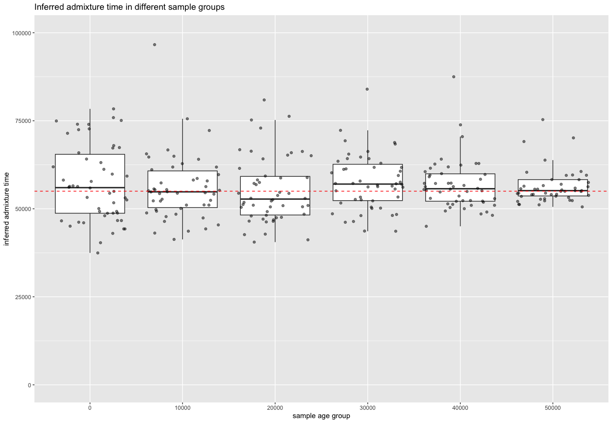<!-- -->

``` r
name <- "EUR_1"

tracts_df %>%
  filter(name == !!name) %>%
  ggplot() +
  geom_rect(aes(xmin = left, xmax = right, ymin = 0, ymax = 1)) +
  scale_x_continuous(labels = scales::comma) +
  xlab("position along a chromosome [bp]") +
  theme(axis.ticks.y = element_blank(), axis.text.y = element_blank()) +
  facet_wrap(~ node_id, nrow = 2,
             labeller = labeller(node_id = function(x) paste0("individual '", name, "', haplotype #", x)))
```

<!-- -->

## Admixture dating in empirical data

``` r
metadata <- read_metadata() %>% dplyr::rename(sample_age = ageAverage)
#> Rows: 4172 Columns: 32
#> ── Column specification ────────────────────────────────────────────────────────
#> Delimiter: "\t"
#> chr (22): sampleId, popId, site, country, region, groupLabel, groupAge, flag...
#> dbl (10): shapeA, latitude, longitude, age14C, ageHigh, ageLow, ageAverage, ...
#> 
#> ℹ Use `spec()` to retrieve the full column specification for this data.
#> ℹ Specify the column types or set `show_col_types = FALSE` to quiet this message.

metadata$age_group <- cut(metadata$sample_age,
                           breaks = c(Inf, 35e3, 30e3, 25e3, 20e3, 15e3, 12e3, 10e3, 5e3,  0))

group_levels <- levels(metadata$age_group)

metadata <- metadata %>%
  mutate(
    age_group = as.character(age_group),
    age_group = ifelse(is.na(age_group), "present-day", age_group),
    age_group = factor(age_group, levels = c("present-day", group_levels))
  )

ggplot(metadata) +
  geom_jitter(aes(age_group, sample_age, color = age_group)) +
  theme_bw() +
  theme(legend.position = "none", text = element_text(size = 15, angle = 45, hjust = 1),
        axis.title.x = element_text(size = 15, angle = 0, hjust = 0.5))
```

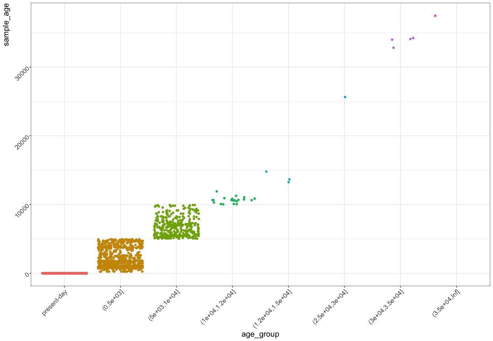<!-- -->

``` r
metadata %>%
  group_by(age_group) %>%
  summarise(mean(sample_age))
#> # A tibble: 8 × 2
#>   age_group         `mean(sample_age)`
#>   <fct>                          <dbl>
#> 1 present-day                       0 
#> 2 (0,5e+03]                      1970.
#> 3 (5e+03,1e+04]                  6738.
#> 4 (1e+04,1.2e+04]               10652.
#> 5 (1.2e+04,1.5e+04]             13907.
#> 6 (2.5e+04,3e+04]               25635 
#> 7 (3e+04,3.5e+04]               33785.
#> 8 (3.5e+04,Inf]                 37470
```

``` r
library(sf)
#> Linking to GEOS 3.11.0, GDAL 3.5.3, PROJ 9.1.0; sf_use_s2() is TRUE
library(rnaturalearth)

world <- ne_countries(scale = "medium", returnclass = "sf")
sf::st_agr(world) <- "constant"
bbox <- st_as_sfc(st_bbox(c(xmin = -25, xmax = 65, ymin = 25, ymax = 70), crs = st_crs(world)))
western_eurasia <- st_crop(st_make_valid(world), bbox)

metadata %>%
  filter(!is.na(latitude) & !is.na(longitude)) %>%
  st_as_sf(coords = c("longitude", "latitude")) %>%
  st_set_crs(4326) %>%
  ggplot() +
    geom_sf(data = western_eurasia) +
    geom_sf(aes(color = age_group)) +
    coord_sf(crs = 3035) +
    facet_wrap(~ age_group) +
    theme_bw() +
    theme(legend.position = "none", text = element_text(size = 15))
```

<!-- -->

``` r
tracts_df <- rbind(read_tracts("Modern"), read_tracts("Ancient"))
#> Rows: 4172 Columns: 32
#> ── Column specification ────────────────────────────────────────────────────────
#> Delimiter: "\t"
#> chr (22): sampleId, popId, site, country, region, groupLabel, groupAge, flag...
#> dbl (10): shapeA, latitude, longitude, age14C, ageHigh, ageLow, ageAverage, ...
#> 
#> ℹ Use `spec()` to retrieve the full column specification for this data.
#> ℹ Specify the column types or set `show_col_types = FALSE` to quiet this message.
#> Rows: 1272453 Columns: 26
#> ── Column specification ────────────────────────────────────────────────────────
#> Delimiter: "\t"
#> chr  (8): ID, population, superpop, region, clusterAlias, pop, groupAge, arc...
#> dbl (17): ageAverage, chrom, start, end, slod, sites, positive_lods, negativ...
#> lgl  (1): anc
#> 
#> ℹ Use `spec()` to retrieve the full column specification for this data.
#> ℹ Specify the column types or set `show_col_types = FALSE` to quiet this message.
#> Rows: 4172 Columns: 32
#> ── Column specification ────────────────────────────────────────────────────────
#> Delimiter: "\t"
#> chr (22): sampleId, popId, site, country, region, groupLabel, groupAge, flag...
#> dbl (10): shapeA, latitude, longitude, age14C, ageHigh, ageLow, ageAverage, ...
#> 
#> ℹ Use `spec()` to retrieve the full column specification for this data.
#> ℹ Specify the column types or set `show_col_types = FALSE` to quiet this message.
#> Rows: 1272453 Columns: 26
#> ── Column specification ────────────────────────────────────────────────────────
#> Delimiter: "\t"
#> chr  (8): ID, population, superpop, region, clusterAlias, pop, groupAge, arc...
#> dbl (17): ageAverage, chrom, start, end, slod, sites, positive_lods, negativ...
#> lgl  (1): anc
#> 
#> ℹ Use `spec()` to retrieve the full column specification for this data.
#> ℹ Specify the column types or set `show_col_types = FALSE` to quiet this message.

tracts_df <- select(metadata, sampleId, sample_age, age_group, coverage) %>%
  inner_join(tracts_df, by = c("sampleId" = "ID")) %>%
  dplyr::rename(name = sampleId, left = start, right = end) %>%
  mutate(chrom = factor(chrom, levels = paste0("chr", 1:22)))
```

``` r
tracts_df %>%
ggplot() +
  geom_density(aes(length), alpha = 0.2) +
  geom_histogram(
    aes(x = length, y = after_stat(density), fill = as.factor(age_group)),
    binwidth = 10000, alpha = 0.75
  ) +
  labs(
    x = "tract length [bp]", y = "density", fill = "age of sample",
    title = "Tract length distribution as a function of admixed sample's age"
  ) +
  scale_x_continuous(labels = scales::comma) +
  expand_limits(y = 0) +
  coord_cartesian(xlim = c(0, 2e6), ylim = c(0, 2e-5)) +
  theme_bw() +
  theme(legend.position = "none", text = element_text(size = 15)) +
  facet_wrap(~ age_group, labeller = labeller(age_group = function(x) paste("sample age:", x, "kya")))
```

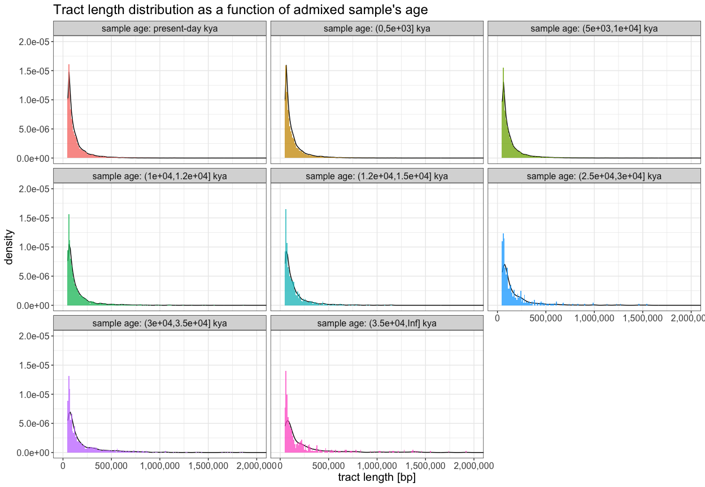<!-- -->

``` r
name <- "Kostenki"

tracts_df %>%
  filter(name == !!name) %>%
  ggplot() +
  geom_rect(aes(xmin = left, xmax = right, ymin = 0, ymax = 1)) +
  facet_wrap(~ chrom, scales = "free_x") +
  ggtitle(name) +
  scale_x_continuous(labels = scales::comma) +
  xlab("position along a chromosome [bp]") +
  theme_bw() +
  theme(axis.ticks.y = element_blank(), axis.text.y = element_blank(),
        axis.text.x = element_text(hjust = 1, angle = 45)) +
  expand_limits(x = 0)
```

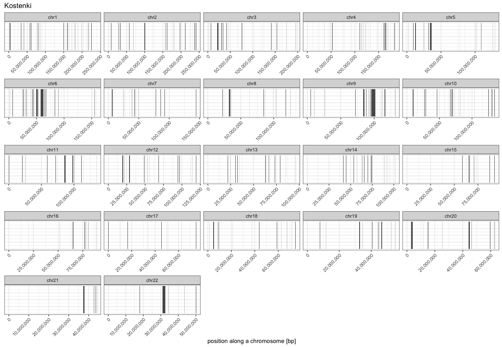<!-- -->

``` r
ggplot(tracts_df) +
  geom_density(aes(length, color = age_group)) +
  coord_cartesian(xlim = c(0, 1e6)) +
  theme_bw() +
  theme(legend.position = "bottom")
```

<!-- -->

### v1 estimate

``` r
# age_group <- "present-day"

min_length <- 50e3
max_length <- Inf

results_v1 <- list()

pdf("dating_tracts_empirical_v1.pdf", width = 14, height = 8)

for (age_group in sort(unique(tracts_df$age_group))) {
  
  # cat("minimum length:", min_length, "\nsample_age:", sample_age, "\n")
  
  r <- 1e-8
  m <- 0.03
  
  filtered_tracts <- tracts_df %>% filter(age_group == !!age_group, length >= min_length, length <= max_length)
  
  sample_age <- filtered_tracts$sample_age %>% mean %>% round %>% as.integer

  # bin the tracts, discarding the very first bin due to very frequent bining artifacts
  # (the lowest bin being extremely small, misrepresenting the true distribution of the data)
  bin_data <- hist(filtered_tracts$length, plot = FALSE, breaks = 101)
  density <- bin_data$density
  length <- bin_data$mids[density > 0]
  density <- density[density > 0]
  
  # lm estimate of admixture time
  #   -- based on log-transformed linear fit of density vs tract length
  lm_res <- lm(log(density) ~ length)
  lambda_lm <- -coef(lm_res)[["length"]]
  if (lambda_lm < 0) lambda_lm <- NA
  
  t_gens_lm <- lambda_lm / r
  t_lm <- t_gens_lm * gen_time + sample_age
  
  # weighted lm estimate of admixture time
  #   -- based on log-transformed linear fit of density vs tract length
  lmw_res <- lm(log(density) ~ length, weights = 1 / length)
  lambda_lmw <- -coef(lmw_res)[["length"]]
  if (lambda_lmw < 0) lambda_lmw <- NA
  
  t_gens_lmw <- lambda_lmw / r
  t_lmw <- t_gens_lmw * gen_time + sample_age
  
  # MLE estimate of admixture time (approximate)
  #  -- based on computing average length as the expectation of the theoretical exponential distribution
  L1 <- mean(filtered_tracts$length)
  lambda_mean1 <- 1 / (L1 - min_length)
  
  t_gens_mean1 <- lambda_mean1 / r
  t_mean1 <- t_gens_mean1 * gen_time + sample_age

  # MLE estimate of admixture time (accurate)
  #  -- based on computing average length as the expectation of the theoretical exponential distribution
  L2 <- mean(filtered_tracts$length)
  lambda_mean2 <- 1 / (L2 - min_length)
  
  t_gens_mean2 <- lambda_mean2 / ((1 - m) * r) + 1
  t_mean2 <- t_gens_mean2 * gen_time + sample_age
  
  # nls estimate -- computing the rate of decay (lambda) by fitting an exponential curve directly
  nls_res <- tryCatch(
    nls(density ~ SSasymp(length, Asym, R0, lrc)),
    error = function(e) NA, warning = function(w) NA
  )
  failed_nls <- !inherits(nls_res, "nls")
  lambda_nls <- if (failed_nls) NA else exp(unname(coef(nls_res)["lrc"]))
  t_gens_nls <- lambda_nls / ((1 - m) * r) + 1
  t_nls <- t_gens_nls * gen_time + sample_age
  
  # plotting
  orig_par <- par(no.readonly = TRUE)
  
  par(mfrow = c(1, 2))
  
  title <- sprintf("sample age %d, tract length [%d kb, %.1f Mb]",
                   sample_age, round(min_length / 1e3, 1), round(max_length / 1e6, 1))
  
  legends <- c(
    sprintf("lm fit: admixture %.1f generations prior ~ %.1f kya", t_gens_lm, round(t_lm / 1e3, 1)),
    sprintf("weighted lm fit: admixture %.1f generations prior ~ %.1f kya", t_gens_lmw, round(t_lmw / 1e3, 1)),
    sprintf("approx MLE fit: admixture %.1f generations prior ~ %.1f kya", t_gens_mean1, round(t_mean1 / 1e3, 1)),
    sprintf("MLE fit: admixture %.1f generations prior ~ %.1f kya", t_gens_mean2, round(t_mean2 / 1e3, 1)),
    sprintf("nls fit: admixture %.1f generations prior ~ %.1f kya", t_gens_nls, round(t_nls / 1e3, 1))
  )
  
  # plot the results on the original exponential scale (although we fit truncated exponential,
  # the rate corresponds to the shape of the original unfiltered exponential function, so we
  # compute dexp() on the original unfiltered x-axis scale for plotting purposes)
  x_values <- sort(unique(c(length, seq(0, max(tracts_df$length), by = 5000))))
  y_lm <- dexp(x_values, rate = lambda_lm)
  y_lmw <- dexp(x_values, rate = lambda_lmw)
  y_mean1 <- dexp(x_values, rate = lambda_mean1)
  y_mean2 <- dexp(x_values, rate = lambda_mean2)
  y_nls <- if (failed_nls) NA else predict(nls_res, newdata = data.frame(length = x_values + min_length))
  
  ylim <- c(min(c(density, y_lm, y_lmw, y_mean1, y_mean2, y_nls), na.rm = TRUE),
            3e-5) #max(c(density, y_lm, y_mean, y_nls), na.rm = TRUE))
  plot(length, density, xlim = c(0, 1e6), main = title, ylim = ylim)
  abline(v = min_length, lty = "dashed")
  lines(x_values + min_length, y_lm, col = "olivedrab4", lty = 2, lwd = 2)
  lines(x_values + min_length, y_lmw, col = "springgreen2", lty = 2, lwd = 2)
  lines(x_values + min_length, y_mean1, col = "red", lty = 2, lwd = 2)
  lines(x_values + min_length, y_mean2, col = "steelblue3", lty = 2, lwd = 2)
  if (!failed_nls)
    lines(x_values + min_length, y_nls, col = "purple", lty = 2, lwd = 2)

  legend("topright", fill = c("olivedrab4", "springgreen2", "red", "steelblue3", "purple"), legend = legends)
  
  # plot the results on the log-transformed scale
  plot(length, log(density), xlim = c(0, 1e6), main = title, ylim = c(-15, -11))
  abline(v = min_length, lty = "dashed")
  abline(lm_res, col = "olivedrab4", lty = 2, lwd = 2)
  abline(lmw_res, col = "springgreen2", lty = 2, lwd = 2)
  abline(a = log(lambda_mean1) + lambda_mean1 * min_length, b = -lambda_mean1, col = "red", lty = 2, lwd = 2)
  abline(a = log(lambda_mean2) + lambda_mean2 * min_length, b = -lambda_mean2, col = "steelblue3", lty = 2, lwd = 2)
  if (!failed_nls)
    suppressWarnings(lines(x_values, log(y_nls), col = "purple", lty = 2, lwd = 2))
  
  legend("topright", fill = c("olivedrab4", "springgreen2", "red", "steelblue3", "purple"), legend = legends)
  
  par(orig_par)
  
  fitted_idx <- match(length, x_values)
  rmse_lm <- rmse(density, y_lm[fitted_idx])
  rmse_lmw <- rmse(density, y_lmw[fitted_idx])
  rmse_mean1 <- rmse(density, y_mean1[fitted_idx])
  rmse_mean2 <- rmse(density, y_mean2[fitted_idx])
  rmse_nls <- rmse(density, y_nls[fitted_idx])
  
  results_v1[[length(results_v1) + 1]] <- tibble(
    sample_age = as.integer(sample_age),
    min_length = as.integer(min_length),
    method = c("lm", "lm (weighted)", "approx. MLE", "MLE", "nls"),
    lambda = c(lambda_lm, lambda_lmw, lambda_mean1, lambda_mean2, lambda_nls),
    rmse_density = c(rmse_lm, rmse_lmw, rmse_mean1, rmse_mean2, rmse_nls),
    t_inferred = c(t_lm, t_lmw, t_mean1, t_mean2, t_nls),
    ratio_time = t_inferred / t_admix
  )

}

dev.off()
#> quartz_off_screen 
#>                 2

results_v1_df <- do.call(rbind, results_v1)
```

``` r
p_density <- results_v1_df %>%
  ggplot(aes(as.factor(sample_age), rmse_density, color = method)) +
    geom_point() +
    geom_line(aes(group = method)) +
    theme_bw() +
    theme(text = element_text(size = 15)) +
    xlab("sample age [years ago]") +
    ylab("RMSE observed vs fitted tract length density") +
    facet_wrap(~ min_length, nrow = 1,
               labeller = labeller(min_length = function(x) paste("minimum segment length =", as.integer(x) / 1e3, "kb")))

p_time <- results_v1_df %>%
  ggplot(aes(as.factor(sample_age), t_inferred, color = method)) +
    geom_point() +
    geom_line(aes(group = method)) +
    geom_hline(yintercept = 55e3, linetype = "dashed") +
    theme_bw() +
    theme(text = element_text(size = 15)) +
    xlab("sample age [years ago]") +
    ylab("inferred / true admixture time") +
    facet_wrap(~ min_length, nrow = 1,
               labeller = labeller(min_length = function(x) paste("minimum segment length =", as.integer(x) / 1e3, "kb")))

cowplot::plot_grid(p_density, p_time, nrow = 2)
```

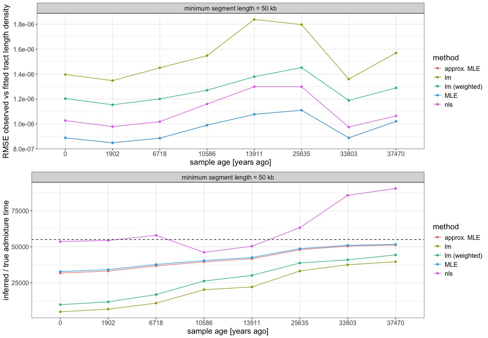<!-- -->

### v2 (MLE) estimate

``` r
# min_length <- 50e3

pdf("dating_tracts_empirical_v2_mle.pdf", width = 12, height = 8)

results_v2_mle <- list()

max_length <- Inf

for (min_length in c(50e3)) {
  tracts_filt_df <- tracts_df %>% filter(length >= min_length, length <= max_length)

  p_tracts <-
    ggplot() +
    geom_histogram(
      data = tracts_filt_df, aes(x = length, y = after_stat(density), fill = as.factor(age_group)),
      binwidth = 10000, alpha = 0.75) +
    # geom_density(
    #   data = tracts_filt_df, aes(x = length, y = after_stat(density), fill = as.factor(sample_age)),
    #   bw = 5000, alpha = 0.75, color = FALSE) +
    labs(
      x = "tract length [bp]", y = "density", fill = "age of sample",
      title = "Tract length distribution as a function of admixed sample's age",
      subtitle = paste0(
        "(assuming single-pulse admixture at ~ 55 kya, tract length [",
        as.integer(min_length / 1e3), " kb, ", max_length / 1e6," Mb])"
      )
    ) +
    scale_x_continuous(labels = scales::comma) +
    expand_limits(y = 0, x = 0) +
    coord_cartesian(ylim = c(0, 2e-5)) +
    theme_minimal() +
    theme(legend.position = "none", text = element_text(size = 15)) +
    facet_wrap(~ age_group, labeller = labeller(age_group = function(x) paste("sample age =", x, "kya")))
  
  r <- 1e-8
  m <- 0.03
  
  exp_df <- group_by(tracts_filt_df, age_group) %>%
    summarise(L = mean(length), sample_age = as.integer(round(mean(sample_age)))) %>%
    mutate(
      lambda = 1 / (L - min_length),
      t_gen = lambda / ((1 - m) * r) + 1,
      t_before = t_gen * gen_time,
      t_inferred = t_before + sample_age
    )
  
  exp_decay <- function(lambda, max) {
    data.frame(length = seq(0, max, by = 1000)) %>%
      mutate(density = dexp(length, rate = lambda))
  }
  
  predictions_df <-
    exp_df %>%
    select(age_group, lambda) %>%
    rowwise() %>%
    mutate(exp_data = list(exp_decay(lambda, max(tracts_filt_df$length)))) %>%
    unnest(cols = c(exp_data)) %>%
    select(-lambda)
  
  p_fit <- p_tracts +
    geom_line(data = predictions_df, aes(x = length + min_length, y = density),
              linetype = "dashed", linewidth = 0.75, color = "black") +
    geom_text(data = exp_df,
              aes(x = Inf, y = Inf, color = age_group,
                  label = paste0(
                    "estimated admixture at ", round(t_inferred / 1e3, 1), " kya\n",
                    "(", round(t_gen), " generations prior)"
                  )),
              hjust = 1.2, vjust = 3, size = 4)
  
  print(p_fit)
  
  results_v2_mle[[length(results_v2_mle) + 1]] <- exp_df %>% mutate(min_length = as.integer(min_length))
}

dev.off()
#> quartz_off_screen 
#>                 2

results_v2_mle_df <- do.call(rbind, results_v2_mle)
```

``` r
inner_join(
  filter(results_v1_df, method == "MLE") %>% select(sample_age, min_length, t_inferred),
  select(results_v2_mle_df, sample_age, min_length, t_inferred),
  by = c("sample_age", "min_length")
) %>%
  mutate(equal = t_inferred.x == t_inferred.y) %>%
  .$equal %>%
  all()
#> [1] TRUE
```

### v2 (NLS) estimate

``` r
# min_length <- 50e3

pdf("dating_tracts_empirical_v2_nls.pdf", width = 12, height = 8)

results_v2_nls <- list()

max_length <- Inf

for (min_length in c(50e3)) {
  tracts_filt_df <- tracts_df %>% filter(length >= min_length, length <= max_length)
    
  age_bins <-
    tibble(age_group = sort(unique(tracts_filt_df$age_group))) %>%
    mutate(bins = lapply(age_group, function(x) {
      # bin the tracts, discarding the very first bin due to very frequent bining artifacts
      # (the lowest bin being extremely small, misrepresenting the true distribution of the data)
      bin_data <- hist(filter(tracts_filt_df, age_group == x)$length, plot = FALSE, breaks = 101)
      density <- bin_data$density
      length <- bin_data$mids[density > 0]
      density <- density[density > 0]
      tibble(length, density)
    })) %>% unnest(bins)

  p_tracts <-
    ggplot() +
    geom_histogram(
      data = tracts_filt_df, aes(x = length, y = after_stat(density), fill = as.factor(age_group)),
      binwidth = 10000, alpha = 0.75) +
    # geom_density(
    #   data = tracts_filt_df, aes(x = length, y = after_stat(density), fill = as.factor(sample_age)),
    #   bw = 5000, alpha = 0.75, color = FALSE) +
    labs(
      x = "tract length [bp]", y = "density", fill = "age of sample",
      title = "Tract length distribution as a function of admixed sample's age",
      subtitle = paste0(
        "(assuming single-pulse admixture at ~ 55 kya, tract length [",
        as.integer(min_length / 1e3), " kb, ", max_length / 1e6," Mb])"
      )
    ) +
    scale_x_continuous(labels = scales::comma) +
    expand_limits(y = 0, x = 0) +
    coord_cartesian(ylim = c(0, 2e-5)) +
    theme_minimal() +
    theme(legend.position = "none", text = element_text(size = 15)) +
    facet_wrap(~ age_group, labeller = labeller(age_group = function(x) paste("sample age: ", x, "kya")))
  
  m <- 0.03

  fit_df <- lapply(sort(unique(age_bins$age_group)),
      function(x) {
        sample_age <- filter(tracts_filt_df, age_group == x)$sample_age %>% mean %>% as.integer
        bin_df <- filter(age_bins, age_group == x)
        nls_res <- tryCatch(
          nls(density ~ SSasymp(length, Asym, R0, lrc), data = bin_df),
          error = function(e) NA, warning = function(w) NA
        )
        failed_nls <- !inherits(nls_res, "nls")
        lambda_nls <- if (failed_nls) NA else exp(unname(coef(nls_res)["lrc"]))
        t_gens_nls <- lambda_nls / ((1 - m) * r) + 1
        t_nls <- t_gens_nls * gen_time + sample_age
        y_nls <- if (failed_nls) NA else predict(nls_res, newdata = data.frame(length = x_values + min_length))
        tibble(sample_age = sample_age,
               age_group = x,
               t_inferred = t_nls,
               t_gen = t_gens_nls,
               fit = list(tibble(length = x_values + min_length, density = y_nls)))
      }
    ) %>% do.call(rbind, .)
  
  p_fit <- p_tracts +
    geom_line(data = unnest(fit_df, fit), aes(x = length, y = density), linetype = "dashed") +
    geom_text(data = fit_df,
              aes(x = Inf, y = Inf, color = as.factor(age_group),
                  label = paste0(
                    "estimated admixture at ", round(t_inferred / 1e3, 1), " kya\n",
                    "(", round(t_gen), " generations prior)"
                  )),
              hjust = 1.2, vjust = 3, size = 4)
  


  print(p_fit)
  
  results_v2_nls[[length(results_v2_nls) + 1]] <- fit_df %>% mutate(min_length = min_length)
}

dev.off()
#> quartz_off_screen 
#>                 2

results_v2_nls_df <- do.call(rbind, results_v2_nls)
```

``` r
inner_join(
  filter(results_v1_df, method == "nls") %>% select(sample_age, min_length, t_inferred),
  select(results_v2_nls_df, sample_age, min_length, t_inferred),
  by = c("sample_age", "min_length")
) %>%
  mutate(equal = t_inferred.x == t_inferred.y) %>%
  .$equal %>%
  all()
#> [1] TRUE
```

### Individual-based NLS estimates

``` r
min_length <- 50e3

results_ind <- list()

max_length <- Inf

all_inds <- tracts_df %>% arrange(-sample_age) %>% pull(name) %>% unique

pdf("dating_tracts_empirical_inds.pdf", width = 12, height = 8)

for (i in seq_along(all_inds)) {
  ind <- all_inds[i]
  # cat(sprintf("Processing individual %s [%d/%d]\n", ind, i, length(all_inds)))

  ind_tracts_df <- filter(tracts_df, length >= min_length, name == ind)
  sample_age <- unique(ind_tracts_df$sample_age)
  age_group <- unique(ind_tracts_df$age_group)

  p_tracts <-
    ggplot() +
    geom_histogram(
      data = ind_tracts_df, aes(x = length, y = after_stat(density)),
      binwidth = 10000, alpha = 0.75) +
    # geom_density(
    #   data = tracts_filt_df, aes(x = length, y = after_stat(density), fill = as.factor(sample_age)),
    #   bw = 5000, alpha = 0.75, color = FALSE) +
    labs(
      x = "tract length [bp]", y = "density", fill = "age of sample",
      title = "Distribution of introgressed tracts",
      subtitle = paste0("name: ", ind, ", date: ", sample_age," years BP")
    ) +
    scale_x_continuous(labels = scales::comma) +
    expand_limits(y = 0, x = 0) +
    coord_cartesian(xlim = c(0, 2e6), ylim = c(0, 2e-5)) +
    theme_minimal() +
    theme(legend.position = "none", text = element_text(size = 15),
          axis.text.x = element_text(hjust = 1, angle = 45))
  
  bin_data <- hist(ind_tracts_df$length, plot = FALSE, breaks = 101)
  density <- bin_data$density[-1]
  length <- bin_data$mids[-1][density > 0]
  density <- density[density > 0]
  data_df <- tibble(length, density)

  r <- 1e-8
  m <- 0.03

  # nls estimate -- computing the rate of decay (lambda) by fitting an exponential curve directly
  # https://www.rdocumentation.org/packages/stats/versions/3.6.2/topics/SSasymp 
  nls_res <- tryCatch(
    nls(density ~ SSasymp(length, Asym, R0, lrc)), data = data_df,
    error = function(e) NA, warning = function(w) NA
  )
  # failed_nls <- !inherits(nls_res, "nls")
  # lambda <- if (failed_nls) 1 / mean(ind_tracts_df$length) else exp(unname(coef(nls_res)["lrc"]))
  lambda <- exp(unname(coef(nls_res)["lrc"]))
  t_gens_before <- lambda / ((1 - m) * r) + 1
  t_inferred <- t_gens_before * gen_time + sample_age
  
  x_values <- sort(unique(c(length, seq(0, max(ind_tracts_df$length), by = 5000))))
  # y_values <- if (failed_nls) dexp(x_values, rate = lambda) else predict(nls_res, newdata = data.frame(length = x_values + min_length))
  y_values <- predict(nls_res, newdata = data.frame(length = x_values + min_length))
  predictions_df <- tibble(length = x_values, density = y_values)

  ind_df <- tibble(
    name = ind, sample_age = sample_age, t_before = t_gens_before,
    t_inferred = t_inferred, min_length = min_length,
    age_group = age_group,
    # method = ifelse(failed_nls, "MLE", "NLS"),
    data = list(data_df),
    fit = list(predictions_df)
  )

  p_fit <- p_tracts +
    geom_line(data = predictions_df, aes(x = length + min_length, y = density),
              linetype = "dashed", linewidth = 0.75, color = "black") +
    geom_text(data = ind_df,
              aes(x = Inf, y = Inf,
                  label = paste0(
                    "estimated admixture at ", round(t_inferred / 1e3, 1), " kya\n",
                    "(", round(t_gens_before), " generations prior)\n"
                    #, ifelse(failed_nls, "MLE estimate", "NLS estimate")
                  )),
              hjust = 1.1, vjust = 2, size = 4)
  
  print(p_fit)

  results_ind[[length(results_ind) + 1]] <- ind_df
}

dev.off()
#> quartz_off_screen 
#>                 2

results_ind_df <- do.call(rbind, results_ind)
```

``` r
saveRDS(results_ind_df, "dating_tracts_empirical_inds.rds")
```

``` r
results_ind_df <- readRDS("dating_tracts_empirical_inds.rds")
```

``` r
results_ind_df %>%
ggplot(aes(age_group, t_inferred, color = age_group, group = name)) +
  geom_jitter(alpha = 0.75) +
  coord_cartesian(ylim = c(0, 150e3)) +
  geom_hline(yintercept = 60e3, linetype = "dashed", color = "black") +
  theme(axis.text.x = element_text(hjust = 1, angle = 45)) +
  labs(x = "sample age group", y = "inferred admixture time",
       title = "Inferred admixture time in different sample groups",
       subtitle = "(Each dot is a single individual; assuming 27 years per generation)")
```

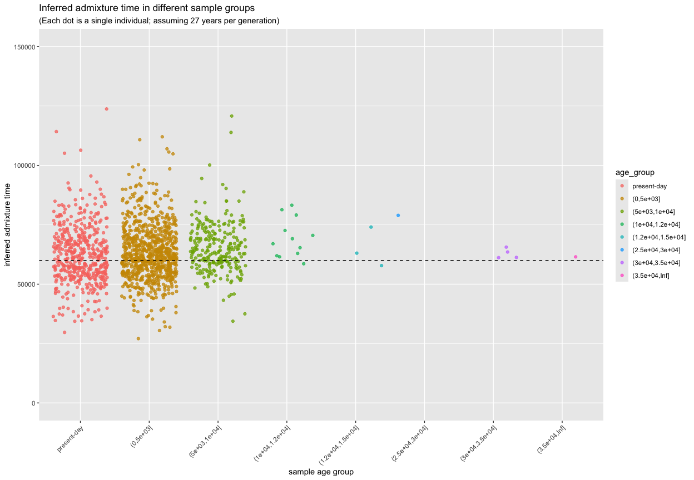<!-- -->

``` r
results_ind_df %>%
ggplot(aes(sample_age, t_inferred)) +
  geom_jitter(alpha = 0.5) +
  coord_cartesian(ylim = c(0, 150e3)) +
  theme(legend.position = "none") +
  theme(axis.text.x = element_text(hjust = 1, angle = 45)) +
  labs(x = "sample age", y = "inferred admixture time",
       title = "Inferred admixture time vs sample time")
```

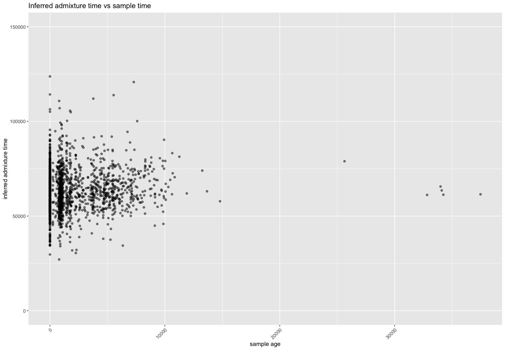<!-- -->

``` r
name <- "HG00113"
name <- "NEO283"
name <- "Kostenki"

p_ind_tracts <- tracts_df %>%
  filter(name == !!name) %>%
  ggplot() +
  geom_rect(aes(xmin = left, xmax = right, ymin = 0, ymax = 1)) +
  expand_limits(x = 0) +
  facet_wrap(~ chrom, scales = "free_x")

ind_df <- filter(results_ind_df, name == !!name)

p_ind_fit <- ggplot() +
  geom_point(data = unnest(ind_df, data), aes(length, density)) +
  geom_line(data = unnest(ind_df, fit), aes(length + min_length, density)) +
  geom_text(data = ind_df, aes(x = Inf, y = Inf,
              label = paste0(
                "estimated admixture at ", round(t_inferred / 1e3, 1), " kya\n",
                "(", round(t_before), " generations prior)\n",
                ifelse(failed_nls, "MLE estimate", "NLS estimate")
              )),
          hjust = 1.1, vjust = 2, size = 4) +
  labs(
    x = "tract length [bp]", y = "density", fill = "age of sample",
    title = "Distribution of introgressed tracts",
    subtitle = paste0("name: ", name, ", date: ", unique(ind_df$sample_age)," years BP")
  ) 

cowplot::plot_grid(p_ind_tracts, p_ind_fit, nrow = 1)
```

<!-- -->
