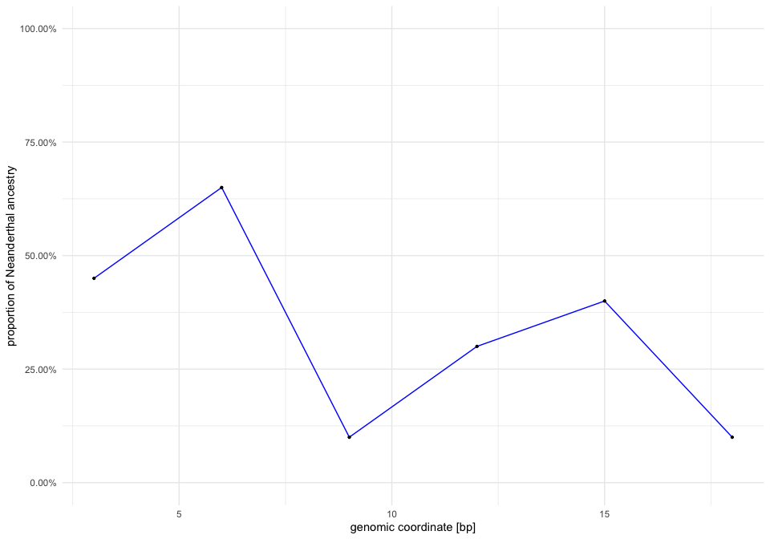

``` r
suppressPackageStartupMessages({
  library(readr)
  library(dplyr)
  library(tidyr)
  library(ggplot2)

  library(GenomicRanges)
  library(ggbio)
})
#> Warning: package 'GenomeInfoDb' was built under R version 4.3.3

source(here::here("utils.R"))
#> 
#> Attaching package: 'plyranges'
#> The following object is masked from 'package:IRanges':
#> 
#>     slice
#> The following objects are masked from 'package:dplyr':
#> 
#>     between, n, n_distinct
#> The following object is masked from 'package:stats':
#> 
#>     filter
```

## Testing window-based tract analysis on a toy example

### Generate testing tracts in a few individuals

``` r
tracts_gr <- GRanges(
  seqnames = "chr7",
  ranges = IRanges(c(2, 4, 12, 4, 12, 5), c(6, 6, 17, 7, 15, 7)),
  ID = c("ind1", "ind2", "ind1", "ind3", "ind3", "ind4")
)
seqlengths(tracts_gr) <- 20

tracts_gr
#> GRanges object with 6 ranges and 1 metadata column:
#>       seqnames    ranges strand |          ID
#>          <Rle> <IRanges>  <Rle> | <character>
#>   [1]     chr7       2-6      * |        ind1
#>   [2]     chr7       4-6      * |        ind2
#>   [3]     chr7     12-17      * |        ind1
#>   [4]     chr7       4-7      * |        ind3
#>   [5]     chr7     12-15      * |        ind3
#>   [6]     chr7       5-7      * |        ind4
#>   -------
#>   seqinfo: 1 sequence from an unspecified genome
```

### Compute Neanderthal ancestry proportions in windows

``` r
pdf("test_windows.pdf", width = 10, height = 13)

par(mfrow = c(4, 1))

plot(NA, xlim = c(1, seqlengths(tracts_gr)), ylim = c(1, length(unique(tracts_gr$ID))), ylab = "individual", yaxt = "n", main = "Archaic ancestry tracts in four individuals")
segments(x0 = start(tracts_gr), x1 = end(tracts_gr), y0 = as.numeric(factor(tracts_gr$ID)), y1 = as.numeric(factor(tracts_gr$ID)), col = factor(tracts_gr$ID))
axis(2, at = 1:length(unique(tracts_gr$ID)), labels = factor(unique(tracts_gr$ID)))

# Compute coverage of Neanderthal tracts per site (i.e. proportion of Neanderthal ancestry per site):

cov <- coverage(tracts_gr)
cov <- cov[[1]]
cov <- cov / length(unique(tracts_gr$ID))

plot(seq_along(cov), cov, type = "o",
     xlim = c(1, seqlengths(tracts_gr)), ylim = c(0, 1), pch = 20,
     ylab = "coverage per site", main = "Tract coverage (i.e. archaic ancestry proportion) per site")

# prop_cov <- cov / length(unique(tracts_gr$ID))
# prop_cov
# plot(prop_cov[[1]], type = "o", xlim = c(1, seqlengths(tracts_gr)))

# runcov <- runmean(cov, 5)
# runcov
# plot(seq_along(runcov), runcov, type = "o", xlim = c(0, seqlengths(tracts_gr)), ylab = "runmean() coverage")

# Generate sliding windows

chrom_length <- seqlengths(tracts_gr)
window_size <- 5
step_size <- 3

windows <- slidingWindows(IRanges(start = 1, end = chrom_length), width = window_size, step = step_size)
windows_gr <- GRanges(seqnames = "chr7", ranges = unlist(windows))
windows_gr$id <- factor(seq_len(length(windows_gr)))
seqlengths(windows_gr) <- seqlengths(tracts_gr)
windows_gr
#> GRanges object with 6 ranges and 1 metadata column:
#>       seqnames    ranges strand |       id
#>          <Rle> <IRanges>  <Rle> | <factor>
#>   [1]     chr7       1-5      * |        1
#>   [2]     chr7       4-8      * |        2
#>   [3]     chr7      7-11      * |        3
#>   [4]     chr7     10-14      * |        4
#>   [5]     chr7     13-17      * |        5
#>   [6]     chr7     16-20      * |        6
#>   -------
#>   seqinfo: 1 sequence from an unspecified genome

# sanity check by plotting overlapping windows sequentially as tiles
# autoplot(windows_gr, aes(group = id), color = NA) + xlim(1, seqlengths(windows_gr))

# generate testing "mapping gaps", "centromeres", etc.

gaps_gr <- GRanges(seqnames = "chr7", ranges = IRanges(start = 8, end = 11))

to_remove <- queryHits(findOverlaps(windows_gr, gaps_gr))
windows_gr$gap <- FALSE
windows_gr[to_remove]$gap <- TRUE

plot(NA, xlim = c(1, seqlengths(windows_gr)), ylim = c(1, length(windows_gr)), ylab = "sliding window number", main = "Coordinates of sliding windows along a chromosome")
segments(x0 = start(windows_gr), x1 = end(windows_gr), y0 = as.numeric(windows_gr$id), y1 = as.numeric(windows_gr$id),
         col = windows_gr$gap + 1)
legend("topleft", fill = c("black", "red"), legend = c("window not in a 'centromere/telomere'", "window in a 'centromere/telomere (to be excluded)"))

# compute windows-based coverage (i.e. proportion of Neanderthal ancestry per window)

average_coverage_per_window <- function(windows_gr, cov) {
  sapply(seq_along(windows_gr), function(i) {
    start_idx <- start(windows_gr[i])
    end_idx <- end(windows_gr[i])
    mean(cov[start_idx:end_idx])
  })
}
mcols(windows_gr)$coverage <- average_coverage_per_window(windows_gr, as.numeric(cov))
mcols(windows_gr)$midpoint <- (start(windows_gr) + end(windows_gr)) / 2

plot(windows_gr$midpoint, windows_gr$coverage,
     ylab = "mean coverage in sliding window", type = "o", xlim = c(1, seqlengths(tracts_gr)), ylim = c(0, 1),
     col = windows_gr$gap + 1, pch = 20,
     main = "Tract coverage (i.e. archaic ancestry proportion) in windows")
legend("topleft", fill = c("black", "red"), legend = c("window not in a 'centromere/telomere'", "window in a 'centromere/telomere (to be excluded)"))

dev.off()
#> quartz_off_screen 
#>                 2
```

### Result of the above is [here](test_windows.pdf)

### Testing a dedicated function `compute_ancestry()`

``` r
ancestry_gr <- compute_ancestry(tracts_gr, windows_gr, keep_gaps = TRUE)
```

### Testing code from a dedicated function `plot_desert_ancestry()`

``` r
as_tibble(ancestry_gr) %>%
{
ggplot(.) +
  geom_line(aes(midpoint, coverage), color = "blue") +
  geom_point(data = filter(., coverage > 0), aes(midpoint, coverage), size = 0.8) +
  guides(color = guide_legend("", override.aes = list(size = 5)),
         linetype = guide_legend("")) +
  labs(x = "genomic coordinate [bp]", y = "proportion of Neanderthal ancestry") +
  scale_x_continuous(labels = scales::comma) +
  scale_y_continuous(labels = scales::percent_format(accuracy = 0.01)) +
  coord_cartesian(ylim = c(0, 1)) +
  scale_linetype_manual(values = "dashed") +
  theme_minimal() +
  theme(legend.position = "bottom") 
}
```

<!-- -->
